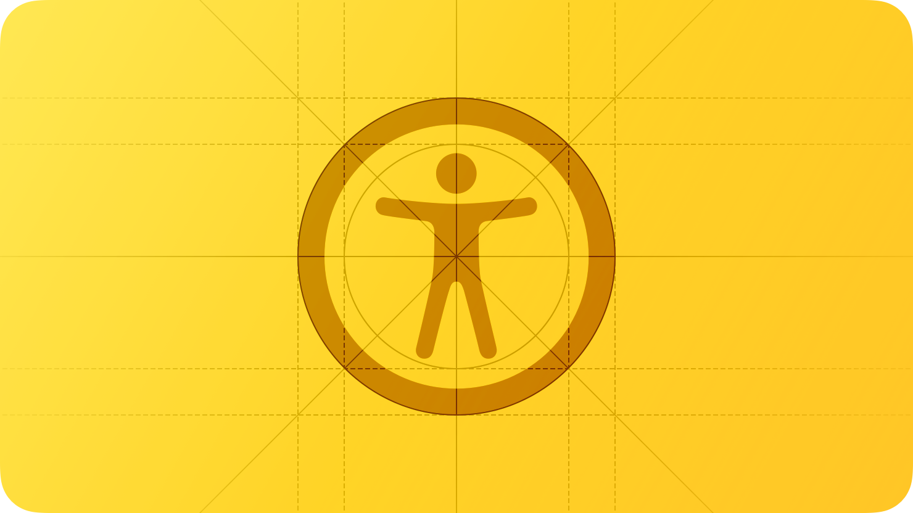
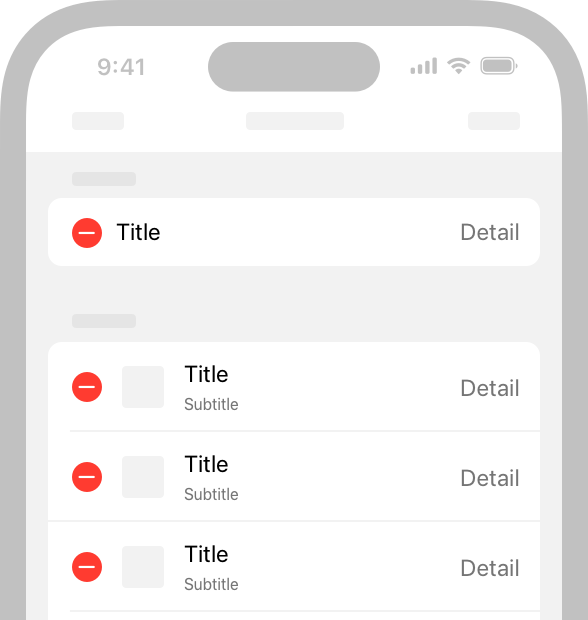
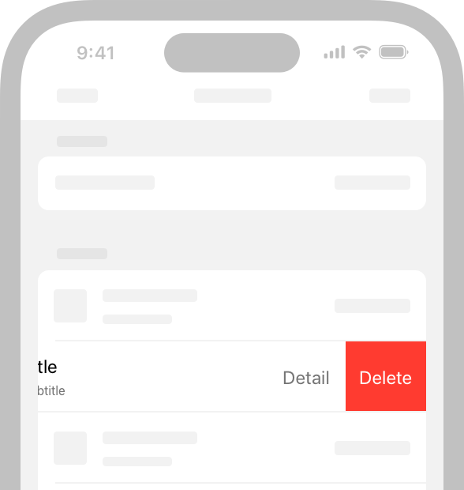
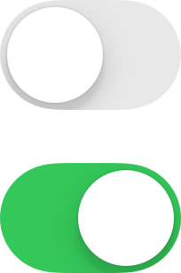
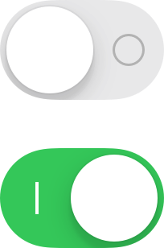

# Accessibility

<h2>사용자는 자신에게 맞는 방식으로 기기와 상호작용하는 방법을 개인화하기 위해 Apple의 손쉬운 사용 기능을 사용합니다.</h2>

  

 

대략 7명 중 1명은 기기와 상호 작용하는데 영향을 미치는 장애를 가지고 있습니다. 사람들은 나이, 기간 또는 다양한 수준의 중증 장애를 경험할 수 있습니다. 예를 들어 넘어짐으로 인한 손목 부상이나 목소리 손실과 같은 장애를 가지고 있는 사람은 다양한 기기와 상호 작용하는 방식에 불편할 수 있습니다.

## Best Practices

**손쉬운 사용을 염두에 두고 디자인하세요.**

손쉬운 사용은 장애가 있는 사람들이 기기를 이용할 수 있도록 하는 것뿐만 아니라 능력이나 상황에 관계없이 모든 사용자가 정보를 이용할 수 있도록 합니다. 손쉬운 사용을 염두에 두고 앱을 설계한다는 것은 단순함과 인지 가능성을 우선시하고 모든 디자인을 결정하여 장애가 있거나 다양한 방식으로 기기와 상호 작용하는 사용자를 배제하지 않도록 하는 것을 의미합니다.

- 복잡한 작업을 단순하고 간단하게 수행할 수 있도록 익숙하고 일관된 상호작용을 지원하세요.
- 모든 콘텐츠는 사람이 시각, 청각, 터치를 사용할 때 인지할 수 있도록 하세요.

 

**개인화를 지원하세요.**

기기 방향, 화면의 크기, 해상도, 색 영역 및 분할 화면과 같은 환경 변화에도 적응할 수 있도록 하세요. 사용자는 어떤 상황에서라도 지원되는 모든 기기에서 즐길 수 있기를 원합니다.
최소한의 노력으로 사용자가 기기와 상호 작용하는 방식을 개인화하는 데 손쉬운 사용 기능을 지원하도록 앱을 디자인 해보세요.
표준 구성 요소를 사용해서 인터페이스를 구현하면 텍스트나 컨트롤이 크기, 굵기, 색상 반전, 대비 증가와 같은 여러 손쉬운 사용 설정에 맞게 자동으로 조정됩니다.

> **_NOTES_**
> 
> - 개인화(Personalization): 고객 또는 잠재 고객의 행동 및 니즈에 관한 인사이트를 바탕으로 이들에게 맞춤 설정된 경험을 제공하는 것

 

**접근성을 테스트하세요.**

손쉬운 사용 기능이 켜져 있는 상태에서 중요한 사용자 흐름을 테스트하면 잘못된 방식으로 상호 작용하는 부분을 발견할 수 있습니다. 또한 앱이 뛰어난 사용자 환경을 제공하지 못하는 부분도 발견할 수 있습니다.

예를 들어, 소셜 미디어의 앱의 일반적인 사용자 흐름에 대해 알아보겠습니다. 이 흐름을 구성하고 있는 작업은 다음과 같습니다.

1. 게시된 댓글을 읽습니다.
2. 응답할 댓글 결정합니다.
3. 댓글창을 엽니다.
4. 댓글을 작성합니다.
5. 댓글을 게시합니다.

위 작업처럼 중요한 사용자 흐름마다 VoiceOver, 동작 줄이기 또는 큰 텍스트와 같은 손쉬운 사용 기능을 켜고 해당 흐름의 모든 작업을 어려움 없이 완료할 수 있는지 확인하세요. 발견한 문제를 해결한 후, 다른 손쉬운 사용 기능을 켜고 다시 확인합니다. 문제를 해결하기 위해 Xcode의 손쉬운 사용 검사기를 사용하는 것도 고려해볼 수 있습니다.

## Interactions

VoiceOver, Assistive Touch 및 포인터 제어, 스위치 제어와 같은 보조 기술은 사람들이 장치와 상호작용하는 방법을 확장합니다. 이러한 기술은 시스템에서 제공하는 상호작용과 통합되어 있으므로 앱에서 시스템 상호 작용을 올바르게 지원하는 것이 중요합니다.

### Gestures

**제스처 기능을 덮어쓰지 마세요.**

사용자는 시스템 기능을 대상으로 하는 제스처(예: 아래로 스와이프하여 Notification Center 표시)가 사용 중인 앱과 관계없이 잘 작동할 것이라고 생각합니다.

 

**일반적인 상호 작용에는 단순한 제스처를 선호하세요.**

양손 또는 여러 손가락을 사용하는 제스처, 길게 누르기, 반복적인 제스처는 복잡하고 사용자에게 많은 어려움을 줄 수 있습니다. 가능하면 가장 간단한 제스처를 사용해 앱과 상호 작용하도록 하세요. 

 

**제스처 기반 작업을 수행할 수 없는 사용자를 위한 다른 방법도 제공하세요.**

예를 들어, 사용자가 제스처를 사용해서 테이블에서 행을 삭제할 수 없다면, 편집 모드를 통해 항목을 삭제하거나 항목 상세 보기에서 삭제 버튼을 제공하는 것이 좋습니다.

  
  

**가능하면, 두 가지 이상의 물리적 상호 작용으로 앱의 핵심 기능을 사용할 수 있도록 만드세요.**

예를 들어, iPhone과 iPad의 카메라는 화면 상 버튼을 탭하거나 음량 낮추기 버튼을 눌러 사진을 찍을 수 있습니다. 이러한 대체 상호 작용은 사진 촬영을 더 편리하게 할 수 있도록 하는 것 외에도 악력이나 민첩성이 제한된 사용자에게 추가 옵션으로 제공할 수 있습니다.

 

**커스텀 제스처를 정의하는 경우, 앱과 상호작용할 수 있는 보조 기술(대체 방법)을 지원하는 것이 중요합니다.**

예를 들어, Pointer Control을 사용하면 사람들이 손목, 검지 손가락 또는 머리 기반 포인터를 사용할 수 있습니다. Dwell Control을 사용하면 눈만 사용하여 객체를 선택하고 활성화할 수 있습니다. VoiceOver, Dwell Control 및 Switch Control과 같은 기술을 지원하는 한 가지 방법은 사용자 정의 액션을 구현하는 것입니다. 개발자 가이드라인은 [UIAccessibilityCustomAction](https://developer.apple.com/documentation/uikit/uiaccessibilitycustomaction)을 참고하세요.

 

**iOS 또는 iPadOS 앱에서 드래그 앤 드롭을 사용할 수 있도록 하세요.**

앱에서 드래그할 소스와 드롭할 대상을 식별하기 위해 손쉬운 사용 API를 사용하면 보조 기술을 통해 사용자가 항목을 끌고 놓을 수 있도록 도와줄 수 있습니다.
개발자 가이드라인은 [accessibilityDragSourceDescriptors](https://developer.apple.com/documentation/uikit/uiaccessibilitycustomaction)와 [accessibilityDropPointDescriptors](https://developer.apple.com/documentation/uikit/uiaccessibilitycustomaction)를 참고하세요.

### Buttons and controls

**모든 컨트롤과 상호 작용 요소에 충분히 큰 히트 타겟을 부여하세요.**

터치스크린 기기에서 히트 타겟은 적어도 44x44pt여야 합니다. visionOS의 경우 컨트롤을 배치할 때 중심 거리가 최소 60pt 떨어져 있도록 배치해야 합니다. 거동이 불편한 사용자는 앱과 상호 작용할 때 더 큰 히트 타겟이 필요합니다. 어떤 플랫폼에서도 작은 컨트롤과 상호 작용하는 것은 사용자가 사용할 때 불편함을 느낄 수 있습니다.

 

**사용자 정의 요소의 접근성을 특성화하세요.**

시스템 API를 사용해서 보조 기술로 구성요소의 동작 방식을 알릴 수 있습니다. 예를 들어, [button](https://developer.apple.com/documentation/uikit/uiaccessibilitytraits/1620194-button) 또는 [NSAccessibilityButton](https://developer.apple.com/documentation/appkit/nsaccessibilitybutton)을 사용해서 뷰를 버튼으로 특성화하면 VoiceOver가 뷰의 설명과 "버튼"이라는 단어를 차례대로 말하므로 사용자에게 뷰가 버튼처럼 동작한다고 알려줄 수 있습니다.

 

**상대적인 중요성을 전달하기 위해 일관된 스타일 계층 구조를 사용하세요.**

iOS, iPadOS 및 tvOS에서는 뷰 내에서 조금 더 중요한 작업을 수행하는 버튼에 시각적으로 두드러지고 채워진 스타일을 사용하고, 덜 중요한 작업을 수행하는 버튼에는 회색 또는 일반적인 스타일과 같이 덜 두드러진 스타일을 사용할 수 있습니다.([UIButton.Configuration](https://developer.apple.com/documentation/uikit/uibutton/configuration)을 참고하세요.) visionOS에서는 시스템에서 제공하는 버튼이 기본적으로 가시적인 배경을 포함합니다. iOS, iPadOS, visionOS 및 macOS의 일부 버튼에서는 Button Shapes 기능을 켜서 주변 요소와 구별하기 쉽게 만들 수도 있습니다.

 

**시스템에서 제공하는 스위치 컴포넌트를 선호하세요.**

SwiftUI는 스위치를 제공하며, 이 스위치는 노브의 위치와 채우기 색상으로 상태를 나타냅니다. 여기에 스위치 레이블을 추가한다면 일부 사용자는 스위치가 켜져 있는지 아닌지를 더 쉽게 인식할 수 있습니다. 시스템에서 제공하는 스위치를 사용하면 iOS, iPadOS, tvOS, visionOS 및 watchOS에서 온/오프 레이블을 켜면 자동으로 스위치 내에 온/오프 글리프가 표시됩니다.

> **_NOTES_**
> 
> - 노브(knob): 스위치 컴포넌트를 구성하고 있는 하얀색 원형 손잡이
> - 글리프(glyph): 특정 형태의 윤곽선 또는 이와 같은 역할을 하는 그래픽 이미지

  
  

**링크에 색상 외에도 밑줄과 같은 시각적 표시를 제공하는 것이 좋습니다.**

링크를 식별하기 위해 색상을 사용하는 것은 좋지만 색상을 유일한 표시로 사용하면 색맹, 인지 및 주의력 결핍 장애를 가진 사용자는 그 차이를 인식하지 못할 수 있습니다.

### User inputs

**사람들이 타이핑이나 제스처 대신 음성으로 정보를 입력할 수 있도록 해주세요.** 

텍스트 입력 필드에 받아쓰기 버튼을 추가하면 사용자가 입력 방법을 음성으로 선택할 수 있습니다. 사용자 설정 키보드를 만들 경우, 받아쓰기를 위한 마이크 키를 포함해야 합니다.

 

**중요한 작업을 음성만으로 수행할 수 있도록 Siri 또는 단축어를 지원하세요.**

앱에서 Siri 상호 작용을 도와주는 방법에 대한 자세한 내용은 [Siri](https://developer.apple.com/design/human-interface-guidelines/siri)를 참고하세요.

 

**가능한 경우, 일반 텍스트를 선택하는 것을 막지 마세요.** 

많은 사용자가 선택한 일반 텍스트를 번역하거나 입력으로 활용하므로 이를 방해하지 않도록 해야 합니다.

### Haptics

**사용 가능한 경우, 시스템에서 정의한 햅틱을 지원하세요.**

다수의 사용자는 디스플레이를 볼 수 없을 때 앱과 상호 작용하기 위해 햅틱에 의존합니다. 예를 들어, 시스템 앱은 햅틱을 재생하여 작업이 성공하거나 실패했을 때 또는 이벤트가 발생하기 전에 사용자에게 알립니다. 사용자에게 혼란을 주지 않도록 앱에서 시스템에서 정의한 햅틱을 일관되게 사용해보세요. 자세한 내용은 [Playing haptics](https://developer.apple.com/design/human-interface-guidelines/playing-haptics)를 참고하세요.

## VoiceOver

VoiceOver는 화면을 볼 수 없을 때 정보를 얻고 탐색하는데 도움이 되는 듣기 설명을 제공합니다. visionOS에서 VoiceOver는 공간 음향을 사용해서 접근 가능한 대상체의 위치를 전달합니다.

> **Important**
> 
> visionOS에서 VoiceOver가 활성화되어 있는 경우, 사용자 정의 제스처를 정의하고 있는 앱은 기본적으로 손 입력을 받지 않습니다.
> 대신 사용자는 앱이 그들의 손 입력을 해석하는 것을 걱정하지 않고 앱을 탐색하기 위해 VoiceOver 제스처를 수행할 수 있습니다.
> VoiceOver의 직접 제스처(Direct Gesture) 모드에서는 VoiceOver가 표준 제스처를 처리하지 않고 앱이 손 입력을 직접 처리하도록 합니다. 
> 개발자 가이드라인은 [Improving accessibility support in your visionOS app](https://developer.apple.com/documentation/visionOS/improving-accessibility-support-in-your-app)을 참고하세요.

### Content descriptions

**의미를 전달하는 모든 이미지에 부가 설명을 제공하세요.**

콘텐츠에서 중요한 이미지에 부가 설명이 없으면 VoiceOver 사용자는 앱을 완전히 경험하지 못하게 됩니다. 유용한 설명을 만들려면 이미지를 볼 수 있는 사람에게 자명한 내용을 보고하는 것으로 시작하세요. VoiceOver는 이미지 주위의 텍스트와 캡션을 읽으므로 이미지 자체에서 전달되는 정보만 설명하세요.

> - 예시 "이동 이미지: 이동 125 퍼센트; 운동 이미지: 운동 0 퍼센트; 서 있는 중 이미지: 서 있는 중 58 퍼센트"

 

**인포그래픽에 완전하게 접근할 수 있도록 하세요.**

인포그래픽이 전달하는 내용에 대한 간단한 설명을 제공하세요. 사용자가 인포그래픽과 상호 작용하여 더 많은 정보를 얻을 수 있는 경우 VoiceOver 사용자도 이러한 상호 작용을 사용할 수 있도록해야 합니다. 손쉬운 사용 API는 보조 기술을 통해 맞춤형 대화형 요소를 나타내는 방법을 제공합니다.

 

**이미지가 순전히 장식 역할로 아무런 정보도 전달하지 않는 경우 보조 기술에서 숨기세요.**

VoiceOver가 장식 역할의 이미지를 설명하도록 하면 사용자의 시간을 낭비하고 아무런 이점도 제공하지 않으며, 인지 부하를 가중시킵니다.

 

**각 페이지에 고유한 제목을 부여하고 정보 계층의 섹션을 식별하는 제목을 제공하세요.**

제목은 사용자가 페이지를 확인할 때 보조 기술을 통해 받는 첫 번째 정보입니다. 앱의 구조를 이해하는 데 도움을 줄 수 있도록 각 페이지의 해당 내용이나 목적이 간결하게 드러나는 고유한 제목을 만드세요. 마찬가지로 사용자는 각 페이지의 정보 계층의 구조를 파악하는 데 도움이 되는 정확한 섹션 제목이 필요합니다.

 

**모든 사용자가 비디오 및 오디오 콘텐츠를 즐길 수 있도록 도와주세요.**

선택 자막, 오디오 설명 및 스크립트를 제공하면 사용자에게 적합한 방식으로 오디오 및 비디오 콘텐츠의 이점을 누릴 수 있도록 도울 수 있습니다.

청각 장애인용 자막은 동영상의 청각 정보에 해당하는 텍스트를 제공합니다. 또한 자막을 사용하여 동일한 콘텐츠에 대해 여러 번역을 제공하여 시스템이 기기의 현재 설정과 일치하는 버전을 선택하도록 할 수 있습니다. 
자막을 항상 사용할 수 있는 것은 아니기 때문에 자막을 제공하는 것도 중요합니다.

오디오 설명은 시각적으로만 제공되는 중요한 정보에 대한 음성 내레이션을 제공합니다.
스크립트는 청각 및 시각 정보를 모두 포함하는 비디오에 대한 완전한 텍스트 설명을 제공하므로 사용자가 다양한 방식으로 비디오를 즐길 수 있습니다.

개발자 가이드라인은 [Selecting Subtitles and Alternative Audio Tracks](https://developer.apple.com/documentation/avfoundation/media_playback/selecting_subtitles_and_alternative_audio_tracks)를 참고하세요.

## Navigation

**VoiceOver 사용자가 앱의 모든 요소를 탐색할 수 있는지 확인하세요.**

VoiceOver는 UI 컴포넌트의 손쉬운 사용 정보를 사용하여 각 요소의 위치와 해당 요소가 수행할 수 있는 작업을 이해할 수 있도록 도움을 줍니다. 시스템에서 제공하는 UI 컴포넌트는 기본적으로 손쉬운 사용 정보를 포함하지만, 사용자 정의 컴포넌트는 정보를 제공해주지 않는 한 VoiceOver가 요소를 발견하고 사용하는 데 도움을 줄 수 없습니다. 개발자 가이드라인은 [Accessibility modifiers](https://developer.apple.com/documentation/SwiftUI/View-Accessibility)를 참고하세요.

 

**컴포넌트를 그룹화하거나, 정렬하거나, 연결하는 방법을 지정하여 VoiceOver 사용 경험을 개선하세요.**

근접성, 정렬 및 기타 상황별 신호는 시각 장애인이 요소 간의 관계를 인식하는 데 도움이 될 수 있지만 VoiceOver 사용자에게는 이러한 신호가 제대로 전달되지 않을 수 있습니다. 앱에서 요소 간의 관계가 시각적으로만 표시되는 위치를 검사하고 이러한 관계를 VoiceOver에게 알려줘야 합니다.

예를 들어서 아래 레이아웃은 근접 및 가운데 맞춤에 의존해서 각 문구가 위 이미지의 캡션임을 알려주고 있습니다. 그러나 VoiceOver에게 각 이미지를 해당 문구와 함께 그룹화해야 한다고 알리지 않으면 VoiceOver는 "다양한 망고를 담을 수 있는 큰 용기입니다. 아티초크를 담을 수 있는 큰 용기입니다. 망고는 Mangifera속에 속하는 나무에서 나옵니다. 아티초크는 다양한 종의 엉겅퀴에서 나옵니다."와 같이 읽습니다. 이는 VoiceOver가 기본적으로 위에서 아래로 요소를 읽기 때문에 발생합니다. 개발자 가이드라인은 [shouldGroupAccessibilityChildren](https://developer.apple.com/documentation/objectivec/nsobject/1615143-shouldgroupaccessibilitychildren)과 [accessibilityTitleUIElement](https://developer.apple.com/documentation/appkit/nsaccessibility/1535155-accessibilitytitleuielement)를 참고하세요.

  
  

**보이는 콘텐츠나 레이아웃이 변경되면 VoiceOver에 알려야합니다.**

예상치 못한 콘텐츠나 레이아웃 변경은 VoiceOver 사용자에게 매우 혼란스러울 수 있습니다. 왜냐하면 변경으로 인해 콘텐츠에 대한 파악점이 더 이상 정확하지 않기 때문입니다. VoiceOver 및 기타 보조 기술이 사용자가 콘텐츠에 대한 이해를 업데이트하는 데 도움이 될 수 있도록 눈에 띄는 변경 사항을 알리는 것이 중요합니다. 개발자 가이드라인은 [UIAccessibility.Notification (UIKit)](https://developer.apple.com/documentation/uikit/uiaccessibility/notification) 또는 [NSAccessibility.Notification (AppKit)](https://developer.apple.com/documentation/appkit/nsaccessibility/notification)을 참조하세요.

 

**컨트롤이 다른 웹페이지나 앱을 여는 시기를 예측할 수 있도록 지원하세요.**

예상치 못한 컨텍스트 변경은 혼란을 일으킬 수 있으며 사용자가 현재 경험을 다시 구축해야 할 수 있습니다. 갑작스런 컨텍스트 변경에 주의를 기울이는 한 가지 방법은 버튼 제목에 생략 부호를 추가하는 것입니다. 시스템 전체에서 버튼 제목 뒤에 생략 부호를 추가하는 것은 사용자가 작업을 완료할 수 있는 다른 창이나 뷰를 열 것임을 전달하는 표준 방법입니다. 예를 들어, iOS 및 iPadOS의 Mail은 메시지 이동 버튼에 생략 부호를 추가하여 별도의 뷰가 열리고 사용자가 선택할 수 있는 별도의 대상이 나열되도록 알립니다.

 

**모든 중요한 UI 컴포넌트에 대해 대체 텍스트 레이블을 제공하세요.**

대체 텍스트 레이블은 시각 장애를 가진 사람들에게 음성으로 앱 요소를 설명하여 탐색을 쉽게 만듭니다. 시스템에서 제공하는 컨트롤은 기본적으로 유용한 레이블을 가지고 있지만 사용자 지정 컴포넌트는 대체 레이블을 만들어야 합니다. 예를 들어, 사용자 정의 등급 버튼을 나타내는 손쉬운 사용 컴포넌트를 만든 경우 "Rate"라는 텍스트 레이블을 제공할 수 있습니다.

 

**필요한 경우 VoiceOver 로터를 지원하세요.**

VoiceOver 사용자는 로터라는 컨트롤러를 사용하여 제목, 링크 또는 기타 섹션 유형으로 문서나 웹페이지를 탐색할 수 있습니다. 또한 로터는 점자 키보드도 불러올 수 있습니다. VoiceOver 사용자가 로터로 관련 항목을 식별하고 탐색할 수 있도록 도울 수 있습니다. 개발자 가이드라인은 [UIAccessibilityCustomRotor](https://developer.apple.com/documentation/uikit/uiaccessibilitycustomrotor) 및 [NSAccessibilityCustomRotor](https://developer.apple.com/documentation/appkit/nsaccessibilitycustomrotor)를 참조하세요.

 

**iPadOS, macOS, visionOS에서는 키보드를 사용하여 앱의 모든 구성 요소를 탐색하고 상호 작용할 수 있도록 해야 합니다.**

이상적으로는 사용자가 전체 키보드 접근을 활성화하고 키보드만 사용하여 모든 작업을 수행할 수 있어야 합니다. 손쉬운 사용 키보드 단축키 외에도 시스템은 사용자가 자주 사용하는 다양한 키보드 단축키를 정의하고 있습니다. 모든 사용자를 지원하려면 앱에서 시스템 정의 단축키를 재정의하지 않도록 하세요. 자세한 내용은 [Keyboards](../inputs/keyboards.md)를 참조하세요.

## Text display

**iOS, iPadOS, tvOS, visionOS, watchOS에서는 Dynamic 타입을 사용하고 앱의 레이아웃이 모든 글꼴 크기에 맞게 조정되는지 테스트하세요.**

Dynamic Type을 사용하면 사용자가 원하는 글꼴 크기를 선택할 수 있습니다. 디자인이 확장되고 텍스트와 글리프를 모든 글꼴 크기에서 읽을 수 있는지 확인하세요. 예를 들어 iPhone이나 iPad에서는 Settings > Accessibility > Display & Text Size > Larger Text에서 큰 텍스트 크기 설정을 활성화하고 편하게 읽히는지 확인하세요. 각 플랫폼에 대한 [Apple Design Resources](https://developer.apple.com/design/resources/)에서 Dynamic Type 크기 표를 다운로드할 수 있습니다.

 

**글꼴 크기가 커짐에 따라 텍스트 잘림 현상을 최소화하세요.**

일반적으로 가장 큰 표준 글꼴 크기와 동일한 양의 유용한 텍스트를 가장 큰 접근성 글꼴 크기에서 표시하도록 노력하세요. 사용자가 나머지 콘텐츠를 읽기 위해 별도의 보기를 열 수 없는 경우 스크롤 가능한 영역에서 텍스트를 자르지 마세요. 레이블에서 텍스트가 잘리도록 하지 않으려면 유용한 양의 텍스트를 표시할 때 필요한 만큼의 줄을 구성하세요. 개발자 가이드라인은 [numberOfLines](https://developer.apple.com/documentation/uikit/uilabel/1620539-numberoflines)를 참고하세요.

 

**큰 글꼴 크기에서 레이아웃을 조정하는 것을 고려하세요.**

가로로 제한된 컨텍스트에서 글꼴 크기가 커지면 인라인 항목 및 컨테이너 경계가 텍스트를 복잡하게 만들어 가독성이 떨어질 수 있습니다. 예를 들어 텍스트를 글리프 또는 타임스탬프와 같은 보조 항목과 함께 인라인으로 표시하면 텍스트의 가로 공간이 줄어듭니다. 큰 글꼴 크기에서는 인라인 레이아웃으로 인해 텍스트가 잘리거나 텍스트와 보조 항목이 겹칠 수 있습니다. 이 경우 텍스트가 보조 항목 위에 표시되는 누적 레이아웃을 사용하는 것이 좋습니다. 마찬가지로 여러 줄의 텍스트는 각 열이 가로 공간을 제한하기 때문에 큰 글꼴 크기에서 가독성이 떨어질 수 있습니다. 이 경우 글꼴 크기가 커짐에 따라 열 수를 줄여서 텍스트 잘림을 방지하고 전반적인 가독성을 높이는 것이 좋습니다. 개발자 가이드라인은 [isAccessibilityCategory](https://developer.apple.com/documentation/uikit/uicontentsizecategory/2897444-isaccessibilitycategory)를 참고하세요.

 

**글꼴 크기가 커짐에 따라 중요한 인터페이스 아이콘의 크기도 키우세요.**

인터페이스 아이콘을 통해 중요한 정보를 전달하는 경우 이러한 아이콘들이 큰 글꼴 크기에서도 쉽게 볼 수 있어야 합니다. [SF Symbols](./sf-symbols.md)를 사용하면 Dynamic Type에 따라 자동으로 크기가 조정되는 아이콘을 표시할 수 있습니다.

 

**현재 글꼴 크기에 관계없이 일관된 정보 계층 구조를 유지하세요.**

예를 들어서 글꼴 크기가 매우 큰 경우에도 기본 요소를 뷰의 상단에 유지해서 사용자가 놓치지 않도록 하세요.

 

**앱에서는 Regular 또는 Heavy 굵기를 선호하세요.**

Regular, Medium, Semibold 또는 Bold 굵기를 사용하는 것이 눈에 잘 띄기 때문입니다. Ultralight, Thin, Light 굵기는 시각적으로 구분하기 어려울 수 있기 때문에 사용하지 마세요.

 

**사용자가 볼드 텍스트 설정을 켰을 때 앱이 올바르게 보이도록 보장하세요.**

iOS, iPadOS, tvOS, visionOS 및 watchOS에서 사용자는 텍스트와 기호를 더 쉽게 볼 수 있도록 볼드 텍스트 설정을 켤 수 있습니다. 이에 대한 응답으로 앱은 모든 텍스트를 더 굵게 만들고 모든 글리프에 선 굵기를 두껍게 해야 합니다. 시스템 글꼴과 SF Symbols는 자동으로 볼드 텍스트 설정에 맞게 조절됩니다.

 

**커스텀 글꼴에서도 가독성이 보장되는지 확인하세요.**

커스텀 글꼴은 때때로 읽기 어려울 수 있습니다. 브랜딩 목적이나 몰입형 게임 경험을 만들어야 하는 경우를 제외하고는 일반적으로 시스템 글꼴을 사용하세요. 커스텀 글꼴을 사용하는 경우 작은 크기에서도 쉽게 읽히도록 해야 합니다.

 

**전체 텍스트 양쪽 맞춤을 피하세요.**

완전히 정렬된 텍스트에 의해 생성된 공백은 사용자가 텍스트를 읽고 집중하기 어렵게 만드는 패턴을 만들 수 있습니다. 왼쪽 맞춤 또는 오른쪽에서 왼쪽으로 쓰는 언어의 오른쪽 맞춤은 난독증과 같은 학습 및 문해력 문제가 있는 사람들을 위한 프레임 참조를 제공합니다.

 

**긴 구절에 모두 대문자로 하거나 이탤릭체로 하지 마세요.**

모두 대문자로 하는 것과 이탤릭체를 사용하는 것은 가끔 강조할 때 좋은 방법이지만, 이러한 스타일을 과도하게 사용하면 텍스트를 읽기 어렵게 만듭니다.

## Color and effects

**색상에만 의존해서 물체를 구별하거나 중요한 정보를 전달하려하지 마세요.**

색상을 사용하여 정보를 전달하는 경우 모든 사용자가 쉽게 인식할 수 있도록 텍스트 레이블이나 글리프 모양을 제공해야 합니다.

 

**텍스트에는 시스템 색상을 사용하는 것이 좋습니다.**

텍스트에 시스템 색상을 사용하면 색상 반전 및 대비 증가와 같은 손쉬운 사용 설정에 올바르게 응답합니다.

 

**두 가지의 상태나 값 사이를 구별하는 유일한 방법으로 색상 조합을 사용하지 마세요.** 

큰 비율로 색맹은 파란색과 주황색을 구별하는 데 어려움을 겪습니다. 다른 문제가 되는 조합으로는 빨간색과 녹색, 빨간색과 검은색, 그리고 빨간색과 또는 녹색과 회색이 결합된 것이 있습니다. 상태나 값을 전달하기 위해 색상 조합을 사용하는 것이 합리적이라고 판단한다면 모든 사용자가 정보를 인식할 수 있도록 추가적인 시각 표시기를 포함하세요. 예를 들면 오프라인과 온라인을 나타내기 위해 빨간색과 녹색 원을 사용하는 대신 빨간색 사각형과 녹색 원을 사용할 수 있습니다. 일부 이미지 편집 소프트웨어에는 색맹에 도움이 되는 도구가 포함되어 있습니다.

 

**뷰가 올바른 색상 반전을 표현하고 있는지 확인하세요.**

사용자는 어두운 배경에서 항목을 보고 싶을 때 색상 반전을 켤 수 있습니다. 색상 반전의 스마트 반전 모드에서는 이미지, 비디오 및 풀 컬러 아이콘(예: 앱 아이콘 및 템플릿이 아닌 이미지)이 반전되지 않으며 어두운 UI가 어둡게 유지됩니다. 앱 또는 게임을 테스트하여 사용자 지정 보기의 사진과 같은 이미지가 반전되지 않도록 해야 할 수 있는 위치를 찾습니다.

사용자는 어두운 환경에서 색상 반전을 켜는 것을 선호합니다. 스마트 반전 모드에서 이미지, 비디오 및 앱 아이콘, 템플릿 이미지는 반전되지 않으며 UI는 어두워진 상태를 유지합니다. 앱이나 게임을 테스트하여 반전되지 않도록 해야할 요소를 찾으세요.

 

**가독성을 높이기 위해 강한 대비의 색상을 사용하세요.**

글꼴 크기와 굵기, 색상의 밝기, 화면 해상도를 포함해 여러 요소가 색상 인식에 영향을 미칩니다. 텍스트, 글리프, 컨트롤과 같은 시각적 요소의 색상 대비를 높이면 더 다양한 컨텍스트에서 앱을 사용할 수 있게 도울 수 있습니다. UI에서 인접한 색상의 대비가 최소 허용 수준을 충족하는지 확인하려면 Xcode의 "Accessibility Inspector" 또는 [Wwb Content Accessibility Guidelines (WCAG)](https://www.w3.org/TR/WCAG21/)의 색상 대비 공식을 기반으로 한 온라인 색상 계산기를 사용할 수 있습니다. 일반적으로 글꼴 크기가 작거나 얇은 경우 대비를 더 높여야 합니다. 아래의 값들을 참고로 사용하세요.

|텍스트 크기|텍스트 굵기|최소 명암비|
|:--|:--|:--|
|최대 17포인트|모두|4.5:1|
|18포인트 이상|모두|3:1|
|모두|Bold|3:1|

 

**사용자가 투명도 감소를 켤 때 블러 및 투명도를 변경해야 합니다.**

예를 들어 흐릿한 콘텐츠와 반투명 영역을 대부분 불투명하게 만듭니다. 최상의 결과를 얻으려면 불투명 영역의 색상 값을 흐리거나 반투명할 때 사용한 원래 색상 값과 다른 색상 값을 사용합니다.

## Motion

**꼭 필요한 애니메이션이 아니라면 사용하는 것은 피하세요.**

일반적으로 애니메이션이 없어도 앱을 사용할 수 있도록 하는 것이 제일 좋습니다.

 

**동작 줄이기가 켜져 있을 때 재생되는 애니메이션을 적용해보세요.**

사용자는 확대/축소, 크기 조절, 회전 또는 주변 동작과 같은 효과가 포함된 애니메이션을 볼 때 주의가 산만해지거나 현기증 또는 메스꺼움을 경험하는 경향이 있는 경우 동작 줄이기를 켤 수 있습니다. 이 설정에 따라 문제를 일으키는 것으로 알려진 애니메이션을 끄거나 줄여야 합니다. 자세한 내용은 [Responsive design for motion](https://webkit.org/blog/7551/responsive-design-for-motion/)을 참고하세요. 문제가 있는 애니메이션을 사용하여 중요한 정보를 전달하는 경우 애니메이션이 아닌 다른 대안을 적용하거나 애니메이션의 물리학을 강화하여 모션을 줄이는 것이 좋습니다. 예를 들어:

- 스프링 효과를 지속시간을 축소해서 바운스 효과를 줄이기
- z축 레이어의 깊이 변경 애니메이션 사용하지 않기
- 블러 효과에서 다른 블러 효과로의 애니메이션 사용하지 않기
- 슬라이드 효과를 페이드 효과로 대체해서 사용하지 않기

**사용자가 비디오와 기타 모션 효과를 제어할 수 있도록 하세요.**

버튼이나 기타 제어 방법을 제공하지 않고 자동으로 비디오나 효과를 재생하도록 설계하지 마세요.

 

**움직이거나 깜빡이는 요소를 표시할 때 주의하세요.**

미묘한 움직임과 깜박임은 사람들의 주의를 끌 수 있지만 이러한 효과는 주의를 산만하게 할 수도 있으며 시각 장애가 있는 사람들에게는 유용하지 않습니다. 설상가상으로, 일부 눈 깜빡임 요소는 간질 발작을 일으킬 수 있습니다. 모든 경우에 움직임과 깜박임을 정보를 전달하는 유일한 방법으로 사용하지 마세요.

이미지와 함께 모션을 경험하는 동안 사람들이 편안하게 머무를 수 있도록  [Motion > visionOS](#visionos)에서 확인하세요. 개발자 가이드라인은 [Improving accessibility support in your visionOS app](https://developer.apple.com/documentation/visionOS/improving-accessibility-support-in-your-app)을 참조하세요.

## Platform considerations

_iOS, iPadOS, macOS, tvOS, watchOS에 대한 추가 고려사항은 없습니다._

### visionOS

**착용자의 머리에 콘텐츠를 고정하지 않도록 피하세요.**

사람들이 갇혀 있거나 갇혀 있다고 느끼게 하는 것 외에도 콘텐츠를 머리에 고정하면 다른 사람이 포인터 컨트롤을 사용하여 해당 콘텐츠와 상호 작용하지 못하게 할 수 있습니다. 머리에 고정된 콘텐츠는 시력이 약한 사람들이 더 가까이 이동하거나 위치를 지정할 수 없기 때문에 콘텐츠를 읽지 못하게 할 수도 있습니다. 콘텐츠 줌 렌즈 내부.
사용자가 갇힌 느낌이나 제한된 느낌을 받을 수 있을 뿐만 아니라 머리에 콘텐츠를 고정하면 해당 콘텐츠와 상호 작용하기 위해 포인터 컨트롤을 사용할 수 없습니다. 고정된 콘텐츠는 시각이 낮은 사용자가 내용을 재위치시키거나 가까이 이동할 수 없어서 읽기 어렵게 만들 수도 있습니다.

## Resources

### Related

- [Inclusion](./inclusion.md)

### Developer documentation

- [Accessibility for developers](https://developer.apple.com/accessibility/)
- [Accessibility](https://developer.apple.com/documentation/Accessibility)
- [Accessibility modifiers](https://developer.apple.com/documentation/SwiftUI/View-Accessibility)
- [Accessibility for UIKit](https://developer.apple.com/documentation/uikit/accessibility_for_uikit)
- [Accessibility for AppKit](https://developer.apple.com/documentation/appkit/accessibility_for_appkit)

### Videos

- [Create accessible spatial experiences](https://developer.apple.com/videos/play/wwdc2023/10034)
- [Design considerations for vision and motion](https://developer.apple.com/videos/play/wwdc2023/10078)
- [The practice of inclusive design](https://developer.apple.com/videos/play/wwdc2021/10275)
