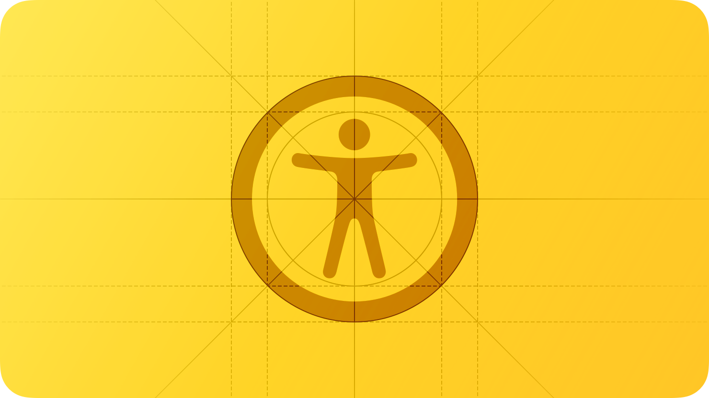
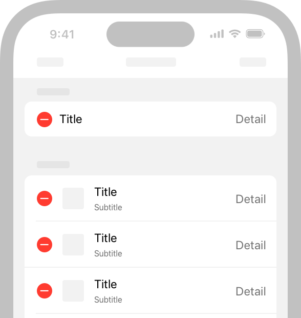
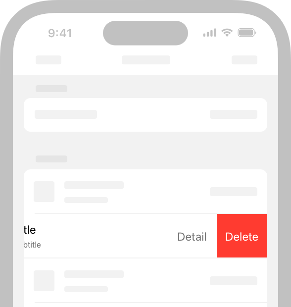
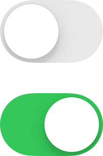
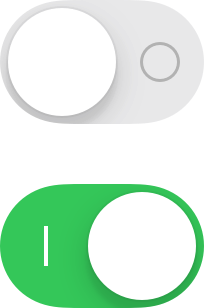

# Accessibility

<h2>사용자는 자신에게 맞는 방식으로 기기와 상호작용하는 방법을 개인화하기 위해 Apple의 손쉬운 사용 기능을 사용합니다.</h2>

  

대략 7명 중 1명은 기기와 상호 작용하는데 영향을 미치는 장애를 가지고 있습니다. 사람들은 나이, 기간 또는 다양한 수준의 중증 장애를 경험할 수 있습니다. 예를 들어 넘어짐으로 인한 손목 부상이나 목소리 손실과 같은 장애를 가지고 있는 사람은 다양한 기기와 상호 작용하는 방식에 불편할 수 있습니다.

## Best Practices

**손쉬운 사용을 고려한 디자인을 추구하세요.**

손쉬운 사용은 단지 장애가 있는 사람들이 기기를 이용할 수 있도록 하는 것에 그치지 않습니다. 그들의 능력이나 상황에 관계없이 모든 사용자가 이용할 수 있도록 하는 것입니다. 손쉬운 사용을 염두에 두고 앱을 설계한다는 것은 단순성과 인지 가능성에 우선순위를 두고 그것이 장애가 있거나 그들의 기기와 다른 방식으로 상호작용하는 사용자들을 배제하지 않도록 모든 설계를 검토하는 것을 의미합니다.

 

**단순함.**

복잡한 작업을 단순하고 간단하게 수행할 수 있도록 익숙하고 일관된 상호작용을 지원하세요.

 

**인지 가능성.**

모든 콘텐츠는 사람이 시각, 청각, 터치를 사용할 때 인지할 수 있도록 하세요.

 

**개인화를 지원하세요.**

사용자는 앱이 어떤 상황에서라도 지원되는 모든 기기에서 즐기기를 원하기 때문에 기기의 방향, 크기, 해상도, 색상, 분할 화면과 같은 환경적 변화에 적응하도록 하세요. 최소한의 추가적인 노력만으로 사람들이 기기와 상호작용하는 방식을 개인화하기 위해 사용하는 손쉬운 사용 기능을 지원하도록 앱을 설계하세요. 표준 구성요소를 사용해서 인터페이스를 구현하면 텍스트의 크기, 굵기, 색상 반전, 대비 증가와 같은 여러 설정에 텍스트 및 컨트롤이 자동으로 적용됩니다.

> **_NOTES_**
> 
> - 개인화(Personalization): 고객 또는 잠재 고객의 행동 및 니즈에 관한 인사이트를 바탕으로 이들에게 맞춤 설정된 경험을 제공하는 것

**접근성을 테스트하세요.**

테스트는 모든 사용자가 기기와 어떻게 상호작용하는지 관계없이 앱에서 가장 중요한 작업을 완수할 수 있도록 도와줍니다. 접근성 기능이 켜져 있는 상태에서 사용자 흐름을 테스트할 때 잘못된 방식으로 상호작용하는 부분을 발견할 수 있습니다. 
예를 들어, 소셜 미디어의 앱의 일반적인 사용자 흐름에 대해 알아보겠습니다. 이 흐름을 구성하고 있는 작업은 다음과 같습니다.

- 게시된 댓글 읽기
- 응답할 댓글 선택
- 댓글 열기
- 댓글 작성
- 댓글 게시

위 작업처럼 중요한 사용자 흐름마다 VoiceOver, 동작 줄이기 또는 더 큰 텍스트와 같은 손쉬운 사용 기능을 켜고 해당 흐름의 모든 작업에 대해 어려움 없이 완료할 수 있는지 테스트하세요. 발견한 문제를 수정한 후에는 다른 손쉬운 사용 기능을 켜고 사용자 흐름을 다시 확인하세요. 문제를 해결하기 위해 Xcode의 손쉬운 사용 검사 도구를 사용하는 것도 고려해볼 수 있습니다.

## Interactions

VoiceOver, Assistive Touch 및 포인터 제어, 스위치 제어와 같은 보조 기술은 사람들이 장치와 상호작용하는 방법을 확장합니다. 이러한 기술은 시스템에서 제공하는 상호작용과 통합되어 있으므로 앱에서 시스템 상호 작용을 올바르게 지원하는 것이 중요합니다.

### Gestures

**제스처 기능을 덮어쓰지 마세요.**

사용자는 사용 중인 앱과 관계없이 시스템 기능을 대상으로 하는 제스처 및 Notification Center를 드러내려고 스와이프하는 제스처가 잘 작동할 것이라고 생각합니다.

 

**일반적인 상호작용에는 단순한 제스처를 사용하세요.**

멀티 탭이나 MultiHand 제스처, 길게 누르기 또는 반복 동작이 필요한 복잡한 제스처는 사용자에게 많은 어려움을 줄 수 있습니다. 가능한 간단한 제스처를 사용해서 앱을 상호작용하는 모든 사용자에게 편안함을 제공하세요.

 

**제스처 기반 작업을 수행할 수 없는 사람들을 위한 대체 방법을 제공하세요.**

예를 들어, 사용자가 제스처를 사용해서 테이블에서 행을 삭제할 수 없다면, 편집 모드를 통해 항목을 삭제하거나 항목 상세 보기에서 삭제 버튼을 제공하는 것이 좋습니다.

  
  

**가능한 경우, 앱의 핵심 기능을 물리적 상호 작용의 여러 유형을 통해 접근이 가능하도록 만드세요.**

예를 들어, iPhone과 iPad의 카메라는 화면 상 버튼을 탭하거나 장치의 볼륨 다운 버튼을 눌러 사진을 찍을 수 있게 합니다. 이러한 대체 상호작용은 사람들에게 사진 촬영을 더 편리하게 만들 뿐만 아니라, 그들 중에서는 악력이나 민첩성이 제한된 사용자에게 추가 옵션을 제공할 수 있습니다.

 

**커스텀 제스처를 정의하는 경우, 앱과 상호작용할 수 있는 보조 기술(대체 방법)을 지원하는 것이 중요합니다.**

예를 들어, Pointer Control을 사용하면 사람들이 손목, 검지 손가락 또는 머리 기반 포인터를 사용할 수 있습니다. Dwell Control을 사용하면 눈만 사용하여 개체를 선택하고 활성화할 수 있습니다. VoiceOver, Dwell Control 및 Switch Control과 같은 기술을 지원하는 한 가지 방법은 사용자 정의 액션을 구현하는 것입니다. 자세한 내용은 [UIAccessibilityCustomAction](https://developer.apple.com/documentation/uikit/uiaccessibilitycustomaction)을 참고하세요.

 

**iOS 또는 iPadOS 앱에서 드래그 앤 드롭을 접근성 있게 만드세요.**

앱에서 드래그할 소스와 드롭할 대상을 식별하기 위해 접근성 API를 사용하면 보조 기술을 통해 사용자가 항목을 끌고 놓을 수 있도록 도와줄 수 있습니다.
자세한 내용은 [accessibilityDragSourceDescriptors](https://developer.apple.com/documentation/uikit/uiaccessibilitycustomaction)와 [accessibilityDropPointDescriptors](https://developer.apple.com/documentation/uikit/uiaccessibilitycustomaction)를 참고하세요.

### Buttons and controls

**모든 컨트롤과 상호작용 요소에 충분히 큰 히트 타겟을 부여하세요.**

터치스크린 기기에서 히트 타겟은 적어도 44x44 pt여야 합니다. visionOS의 경우 컨트롤을 배치할 때 중심 거리가 최소 60 pt여야 합니다. 움직임이 제한된 사용자는 앱과 상호작용할 때 더 큰 히트 타겟이 필요합니다. 작은 컨트롤과 상호작용하는 것은 어떤 플랫폼에서도 사용자가 사용할 때 불편할 수 있습니다.

 

**사용자 정의 요소의 접근성을 특성화하세요.**

시스템 API를 사용해서 보조 기술로 구성요소의 동작 방식을 알릴 수 있습니다. 예를 들어, [button](https://developer.apple.com/documentation/uikit/uiaccessibilitytraits/1620194-button) 또는 [NSAccessibilityButton](https://developer.apple.com/documentation/appkit/nsaccessibilitybutton)을 사용해서 뷰를 버튼으로 특성화하면 VoiceOver가 뷰의 설명 다음에 "버튼"이라고 말하므로 사용자에게 뷰가 버튼처럼 동작한다고 알려줄 수 있습니다.

 

**상대적인 중요성을 전달하기 위해 일관된 스타일 계층을 사용하세요.**

iOS, iPadOS 및 tvOS에서는 뷰 내에서 조금 더 중요한 작업을 수행하는 버튼에 시각적으로 두드러지고 채워진 스타일을 사용하고, 덜 중요한 작업을 수행하는 버튼에는 회색 또는 일반적인 스타일과 같이 덜 두드러진 스타일을 사용할 수 있습니다.([UIButton.Configuration](https://developer.apple.com/documentation/uikit/uibutton/configuration)을 참고하세요.) visionOS에서는 시스템에서 제공하는 버튼이 기본적으로 가시적인 배경을 포함합니다. iOS, iPadOS, visionOS 및 macOS의 일부 버튼에서는 Button Shapes 기능을 켜서 주변 요소와 구별하기 쉽게 만들 수도 있습니다.

 

**시스템에서 제공하는 스위치 컴포넌트를 선호하세요.**

SwiftUI는 스위치를 제공하며, 이 스위치는 노브의 위치와 Fill 컬러로 상태를 나타냅니다. 스위치 레이블을 추가한다면 일부 사용자는 스위치가 켜져 있는지 아닌지를 더 쉽게 인식할 수 있습니다. 시스템에서 제공하는 스위치를 사용하면 iOS, iPadOS, tvOS, visionOS 및 watchOS에서 온/오프 레이블을 켜면 자동으로 스위치 내에 온/오프 글리프가 표시됩니다.

> **_NOTES_**
> 
> - 노브(knob): 스위치 컴포넌트를 구성하고 있는 하얀색 원형 손잡이
> - 글리프(glyph): 특정 형태의 윤곽선 또는 이와 같은 역할을 하는 그래픽 이미지

  
  

**링크에 색상 외에도 밑줄과 같은 시각적 표시를 제공하는 것을 고려해보세요.**

링크를 식별하기 위해 색상을 사용하는 것도 좋지만, 색상을 유일한 표시로 사용하면 색맹, 인지 및 주의력 결핍 장애를 가진 사용자는 차이를 인식하지 못할 수 있습니다.

### User inputs

**사람들이 타이핑이나 제스처 대신 말로 정보를 입력할 수 있도록 해주세요.** 

텍스트 입력 필드에 음성을 선호하는 입력 방법으로 선택할 수 있는 딕테이션 버튼을 추가하면 사람들이 말을 통해 정보를 입력할 수 있습니다. 사용자 정의 키보드를 만들 경우, 딕테이션을 위한 마이크 키를 포함하는지 확인하세요.

 

**중요한 작업을 음성만으로 수행할 수 있도록 Siri나 단축어를 지원하세요.**

앱에서 Siri 상호작용을 도와주는 방법에 대한 자세한 내용은 [Siri](https://developer.apple.com/design/human-interface-guidelines/siri)를 참고하세요.

 

**가능한 경우, 일반 텍스트를 선택하는 것을 막지 마세요.** 

많은 사용자가 선택한 일반 텍스트를 번역하거나 입력으로 활용하므로 이를 방해하지 않도록 해야 합니다.

 

**가능한 경우, 시스템에서 정의한 햅틱을 지원하세요.**

다수의 사용자는 디스플레이를 볼 수 없을 때 앱과 상호작용하기 위해 햅틱에 의존합니다. 예를 들어, 시스템 앱은 작업이 성공하거나 실패했을 때 이벤트가 발생하기 전에 햅틱을 재생해서 사용자에게 알립니다. 앱 시스템에서 정의한 햅틱을 일관되게 사용하여 혼란을 피하세요. 자세한 내용은 [Playing haptics](https://developer.apple.com/design/human-interface-guidelines/playing-haptics)를 참고하세요.

## VoiceOver

VoiceOver는 화면을 볼 수 없을 때 정보를 얻고 탐색하는데 도움이 되는 듣기 설명을 제공합니다. visionOS에서 VoiceOver는 접근 가능한 객체의 위치를 알려주는데 공간 오디오를 사용합니다.

 

> **Important**
> 
> visionOS에서 VoiceOver가 활성화되어 있는 경우, 사용자 정의 제스처를 정의하고 있는 앱은 기본적으로 손 입력을 받지 않습니다.
> 대신 사용자는 앱이 그들의 손 입력을 해석하는 것을 걱정하지 않고 앱을 탐색하기 위해 VoiceOver 제스처를 수행할 수 있습니다.
> VoiceOver의 직접 제스처(Direct Gesture) 모드에서는 VoiceOver가 표준 제스처를 처리하지 않고 앱이 손 입력을 직접 처리하도록 합니다. 
> 개발자 가이드라인은 [Improving accessibility support in your visionOS app](https://developer.apple.com/documentation/visionOS/improving-accessibility-support-in-your-app)을 참고하세요.

### Content descriptions

**의미를 전달하는 모든 이미지에 대해 부가 설명을 제공하세요.**

콘텐츠에서 중요한 이미지의 부가 설명이 없으면 VoiceOver 사용자가 앱을 완전히 경험하지 못하게 됩니다. 유용한 설명을 만들려면 이미지를 볼 수 있는 사람에게 자명한 내용을 보고하는 것으로 시작하세요. VoiceOver는 이미지 주변의 텍스트와 캡션을 읽으므로 설명을 이미지 자체가 전달하는 정보에만 설명을 중점적으로 두세요.

> - 예시 "이동 이미지: 이동 125 퍼센트; 운동 이미지: 운동 0 퍼센트; 서 있는 중 이미지: 서 있는 중 58 퍼센트"

 

**인포그래픽을 완전하게 접근이 가능하도록 하세요.**

인포그래픽을 간결하게 설명하는 간단한 설명을 제공하세요. 사용자가 인포그래픽과 상호작용하여 다양한 정보를 얻을 수 있는 경우 이러한 상호작용을 VoiceOver 사용자에게도 제공해야 합니다. 접근성 API는 맞춤형 대화형 요소를 나타내는 방법을 제공하여 보조 기술이 이를 사용하는 데 도움을 줄 수 있습니다.

 

**이미지가 순전히 장식 역할로 아무런 정보도 전달하지 않는 경우 보조 기술에서 숨기세요.**

VoiceOver가 장식 역할 이미지를 설명하도록 하면 사용자의 시간을 낭비하고 인지 부하를 늘릴 수 있습니다.

 

**각 페이지에 고유한 제목을 부여하고 정보 계층구조에서 섹션을 식별하는 제목을 제공하세요.**

사람들이 페이지에 도착하면 제목이 보조 기술에서 받는 첫 번째 정보입니다. 앱의 구조를 이해하는 데 도움을 주기 위해 각 페이지에 고유한 제목을 만들어 해당 내용이나 목적을 간결하게 설명하세요. 마찬가지로 사람들은 각 페이지의 정보 계층구조를 구축하는 데 도움이 되는 정확한 섹션 제목이 필요합니다.

 

**모든 사용자가 비디오 및 오디오 콘텐츠를 즐길 수 있도록 도와주세요.**

자막, 오디오 설명 및 트랜스크립트를 제공하면 사용자는 본인에게 알맞은 방식으로 오디오 및 비디오 콘텐츠를 활용할 수 있습니다.
자막은 비디오의 청각 정보와 동등한 텍스트를 제공합니다. 닫힌 자막을 사용하여 동일한 콘텐츠에 대한 여러 번역을 제공할 수도 있으며, 시스템이 현재 설정과 일치하는 버전을 선택하도록 할 수 있습니다. 오디오 설명은 시각적으로만 제시되는 중요한 정보에 대해 말로 된 나레이션을 제공합니다.
트랜스크립트는 비디오의 청각 및 시각 정보에 대한 완전한 텍스트 설명을 제공하여 사람들이 다양한 방식으로 비디오를 즐길 수 있도록 합니다.
개발자 가이드라인은 [Selecting Subtitles and Alternative Audio Tracks](https://developer.apple.com/documentation/avfoundation/media_playback/selecting_subtitles_and_alternative_audio_tracks)를 참고하세요.

## Navigation

**VoiceOver 사용자가 모든 요소로 이동할 수 있도록 확인하세요.**

VoiceOver는 UI 컴포넌트에서의 접근성 정보를 사용하여 각 요소의 위치와 해당 요소가 수행할 수 있는 작업을 이해하는 데 도움을 줍니다. 시스템에서 제공하는 UI 컴포넌트는 기본적으로 이러한 접근성 정보를 포함하지만, 사용자가 정보를 제공하지 않으면 VoiceOver가 맞춤형 요소를 발견하고 사용하는 데 도움을 줄 수 없습니다. 개발자 가이드라인은 [Accessibility modifiers](https://developer.apple.com/documentation/SwiftUI/View-Accessibility)를 참고하세요.

 

**요소가 그룹화되거나 정렬되거나 연결된 방식을 지정함으로써 VoiceOver경험을 개선하세요.**

근접성, 정렬 및 기타 맥락 힌트는 시각적으로 인식 가능한 요소 간의 관계를 시각적으로 인식하는 데 시력이 있는 사람들에게 도움이 되지만, 이러한 힌트는 VoiceOver 사용자에게는 잘 작동하지 않습니다. 앱에서 시각적 요소 간의 관계가 시각적인 경우 VoiceOver에게 이러한 관계를 설명하세요.

예를 들어 아래 레이아웃은 각 구문이 위의 이미지의 캡션임을 나타내기 위해 근접성 및 가운데 정렬을 사용합니다. 그러나 각 이미지가 해당 구문과 그룹화되어야 한다고 VoiceOver에게 알리지 않으면 VoiceOver는 "여러 가지 망고를 담고 있는 큰 용기. 다양한 종류의 열매를 담고 있는 큰 용기"와 같이 읽습니다. 이는 VoiceOver가 기본적으로 위에서 아래로 요소를 읽기 때문에 발생합니다. 개발자 가이드라인은 [shouldGroupAccessibilityChildren](https://developer.apple.com/documentation/objectivec/nsobject/1615143-shouldgroupaccessibilitychildren)과 [accessibilityTitleUIElement](https://developer.apple.com/documentation/appkit/nsaccessibility/1535155-accessibilitytitleuielement)를 참고하세요.

 

**보이는 콘텐츠나 레이아웃이 변경되면 VoiceOver에 알려주세요.**

예상치 못한 콘텐츠나 레이아웃 변경은 VoiceOver 사용자에게 매우 혼란스러울 수 있습니다. 왜냐하면 변경으로 인해 콘텐츠에 대한 정신적인 지도가 더 이상 정확하지 않기 때문입니다. 보이는 변경 사항을 보고하여 VoiceOver 및 다른 보조 기술이 사람들이 콘텐츠에 대한 이해를 업데이트하는 데 도움을 줄 수 있습니다. 개발자 가이드라인은 [UIAccessibility.Notification (UIKit)](https://developer.apple.com/documentation/uikit/uiaccessibility/notification) 또는 [NSAccessibility.Notification (AppKit)](https://developer.apple.com/documentation/appkit/nsaccessibility/notification)을 참조하세요.

 

**사용자들이 제어가 다른 웹페이지나 앱을 열 때를 예측하는 데 도움이 되도록 지원하세요.**

예상치 못한 컨텍스트 변경은 혼란을 일으킬 수 있으며 사람들에게 현재 경험의 정신적 모델을 갑자기 재구성하도록 요구할 수 있습니다. 컨텍스트 변경의 가능성에 주의를 기울이는 한 가지 방법은 버튼 제목에 생략 부호를 추가하는 것입니다. 시스템 전반에서 버튼 제목 뒤에 생략 부호를 추가하는 것은 사용자들이 해당 작업을 완료할 수 있는 다른 창이나 뷰를 열 것임을 전달하는 표준 방법입니다. 예를 들어, iOS 및 iPadOS의 메일 앱은 이동 메시지 버튼에 생략 부호를 추가하여 별도의 뷰가 열리고 사용자가 선택할 수 있는 대상이 나열된다는 신호를 보냅니다.

 

**모든 중요한 인터페이스 요소에 대한 대체 텍스트 레이블을 제공하세요.**

대체 텍스트 레이블은 시각 장애를 가진 사람들에게 음성으로 앱 요소를 설명하여 내비게이션을 쉽게 만듭니다. 시스템에서 제공하는 컨트롤은 기본적으로 유용한 레이블을 가지고 있지만 사용자 지정 요소에 대한 레이블을 만들어야 합니다. 예를 들어, 사용자 정의 등급 버튼을 나타내는 접근성 요소를 만든 경우 "Rate"와 같은 레이블을 제공할 수 있습니다.

 

**필요한 경우 VoiceOver 로터를 지원하세요.**

VoiceOver 사용자는 로터라는 컨트롤을 사용하여 제목, 링크 또는 기타 섹션 유형으로 문서나 웹페이지를 탐색할 수 있습니다. 로터는 또한 점자 키보드를 나타낼 수 있습니다. 앱에서 관련 항목을 로터에 식별하여 VoiceOver 사용자가 해당 항목 사이를 이동할 수 있도록 도울 수 있습니다. 개발자 가이드라인은 [UIAccessibilityCustomRotor](https://developer.apple.com/documentation/uikit/uiaccessibilitycustomrotor) 및 [NSAccessibilityCustomRotor](https://developer.apple.com/documentation/appkit/nsaccessibilitycustomrotor)를 참조하세요.

 

**iPadOS, macOS, visionOS에서는 키보드를 사용하여 앱의 모든 구성 요소를 탐색하고 상호 작용할 수 있도록 해야 합니다.**

이상적으로는 사용자가 전체 키보드 액세스를 활성화하고 키보드만 사용하여 경험의 모든 작업을 수행할 수 있어야 합니다. 접근성 키보드 단축키 외에도 시스템은 사용자들이 자주 사용하는 다양한 키보드 단축키를 정의합니다. 모든 사용자를 지원하기 위해 앱에서는 시스템에서 정의한 키보드 단축키를 무시하지 않도록 주의해야 합니다. 자세한 내용은 [Keyboards](../inputs/keyboards.md)를 참조하세요.

## Text display

**iOS, iPadOS, tvOS, visionOS, watchOS에서는 Dynamic Type을 사용하고 앱의 레이아웃이 모든 글꼴 크기에 적응하는지 테스트해야 합니다.**

Dynamic Type을 사용하면 사용자가 원하는 글꼴 크기를 선택할 수 있습니다. 디자인이 확장되고 텍스트와 글리프가 모든 글꼴 크기에서 가독성이 있는지 확인하세요. 예를 들어 iPhone이나 iPad에서는 Settings > Accessibility > Display & Text Size > Larger Text에서 큰 텍스트 크기를 활성화하고 편하게 읽히는지 확인하세요. 각 플랫폼에 대한 [Apple Design Resources](https://developer.apple.com/design/resources/)에서 Dynamic Type 크기 표를 다운로드할 수 있습니다.

 

**글꼴 크기가 커짐에 따라 텍스트를 최소한으로 자르세요.**

일반적으로 가장 큰 표준 글꼴 크기와 동일한 양의 유용한 텍스트를 가장 큰 접근성 글꼴 크기에서 표시하도록 노력하세요. 텍스트를 자르지 말고 스크롤 가능한 영역에서 텍스트를 자를 때는 사용자가 본문의 나머지 부분을 읽을 수 있는 별도의 뷰를 열 수 있도록 해야 합니다. 레이블에서 텍스트를 자르지 않으려면 레이블이 유용한 양의 텍스트를 표시할 수 있도록 필요한 만큼의 줄을 사용하도록 구성하세요. 개발자 가이드라인은 [numberOfLines](https://developer.apple.com/documentation/uikit/uilabel/1620539-numberoflines)를 참고하세요.

 

**큰 글꼴 크기에서 레이아웃을 조정하는 것을 고려하세요.**

가로 제약된 상황에서 글꼴 크기가 커지면 인라인 항목 및 컨테이너 경계가 텍스트를 혼잡하게 만들어 가독성이 떨어질 수 있습니다. 예를 들어 별도의 항목(글리프 또는 타임스탬프와 같은)과 함께 텍스트를 인라인으로 표시하는 경우 텍스트에는 적은 수평 공간이 있습니다. 큰 글꼴 크기에서는 인라인 레이아웃이 텍스트를 자르거나 텍스트와 별도의 항목이 겹치게 할 수 있습니다. 이 경우 텍스트가 별도의 항목 위에 나타나는 쌓인 레이아웃을 사용하는 것을 고려해 보세요. 마찬가지로 여러 열의 텍스트는 각 열이 수평 공간을 제한하기 때문에 큰 글꼴 크기에서 가독성이 떨어질 수 있습니다. 이 경우 글꼴 크기가 커짐에 따라 열 수를 줄여서 텍스트 자르기를 피하고 전반적인 가독성을 향상시키기 위해 열 수를 줄이는 것이 좋습니다. 개발자 가이드라인은 [isAccessibilityCategory](https://developer.apple.com/documentation/uikit/uicontentsizecategory/2897444-isaccessibilitycategory)를 참고하세요.

 

**폰트 크기가 커짐에 따라 중요한 인터페이스 아이콘의 크기를 키우세요.**

중요한 정보를 전달하기 위해 인터페이스 아이콘을 사용하는 경우, 이러한 아이콘들이 더 큰 폰트 크기에서도 쉽게 볼 수 있도록 해야 합니다. [SF Symbols](./sf-symbols.md)를 사용하면 자동으로 크기가 조절되는 Dynamic Type 아이콘을 얻을 수 있습니다.

 

**폰트 크기에 관계없이 일관된 정보 계층을 유지하세요.**

예를 들어서 폰트 크기가 매우 큰 경우에도 주요 요소를 뷰의 상단에 유지해서 사용자가 이러한 요소를 찾을 수 있도록 해야 합니다.

 

**앱에서는 Regular 또는 Heavy 폰트 굵기를 선호하세요.**

Regular, Medium, Semibold, Bold 폰트 굵기를 사용하는 것이 눈에 잘 띄기 때문입니다. Ultralight, Thin, Light 폰트 굵기는 시각적으로 구분하기 어려울 수 있기 때문에 사용을 피하는 것이 좋습니다.

 

**사용자가 볼드 텍스트 설정을 켰을 때 앱이 올바른 응답으로 반응하도록 보장하세요.**

iOS, iPadOS, tvOS, visionOS 및 watchOS에서 사용자는 텍스트와 심볼을 더 쉽게 볼 수 있도록 볼드 텍스트 설정을 켤 수 있습니다. 이에 대한 응답으로 앱은 모든 텍스트를 두껍게 만들고 모든 글리프에 선 굵기를 두껍게 해야 합니다. 시스템 글꼴과 SF Symbols는 자동으로 볼드 텍스트 설정에 맞게 조절됩니다.

 

**커스텀 폰트에서도 가독성이 보장되는지 확인하세요.**

커스텀 폰트는 가끔 읽기 어려울 수 있습니다. 브랜딩 목적이나 몰입형 게임 경험을 만들어야 하는 경우를 제외하고는 일반적으로 시스템 폰트를 사용하는 것이 좋습니다. 커스텀 폰트를 사용하는 경우 작은 크기에서도 쉽게 읽히도록 해야 합니다.

 

**전체 텍스트 정렬을 피하세요.**

전체로 정렬된 텍스트에 의해 생성된 공백은 많은 사람들이 텍스트를 읽고 집중하는 데 어려움을 겪을 수 있는 패턴을 만들 수 있습니다. 왼쪽 정렬(또는 오른쪽에서 왼쪽으로 읽는 언어의 경우 오른쪽 정렬)은 학습 및 글쓰기 도전에 직면한 사람들을 위한 프레임 참조를 제공합니다(디스렉시아와 같은 경우).

 

**긴 텍스트를 모두 대문자로 하거나 이탤릭체로 하지 마세요.**

모두 대문자로 하는 것과 이탤릭체를 사용하는 것은 가끔 강조할 때 좋은 방법이지만, 이러한 스타일을 과도하게 사용하면 텍스트를 읽기 어렵게 만듭니다.

## Color and effects
