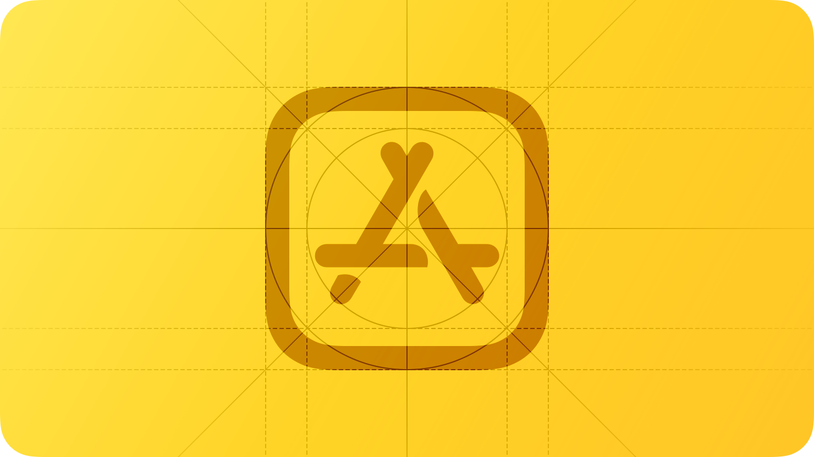
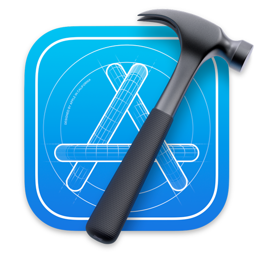
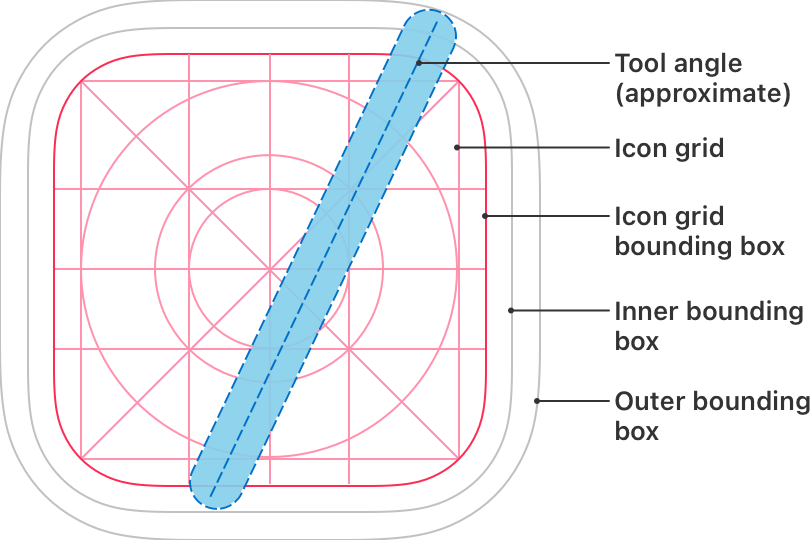

# App icons

<h2>독특하고 기억에 남는 아이콘은 여러분의 앱이나 게임의 목적과 개성을 전달하며, 사용자가 제품을 한눈에 인식하는 데 도움이 됩니다.</h2>

  

멋진 앱 아이콘은 모든 Apple 플랫폼에서 사용자 경험의 중요한 일부분을 차지하므로 반드시 갖추어야 합니다. 각 플랫폼은 앱 아이콘을 다른 스타일로 정의하고 있어서 모양과 의미의 일관성을 유지하면서 디자인 해야합니다. 각 플랫폼마다 아이콘을 만들 수 있도록 도움을 줄 수 있는 템플릿을 다운로드 하려면 [Apple Design Resources](https://developer.apple.com/design/resources/)를 참고하세요.
다른 유형의 아이콘을 만드는 데 도움이 되는 가이드라인은 [Icons](./icons.md)를 확인하세요.

## Best practices

**단순함을 채택하세요.**

단순한 아이콘은 사용자가 앱을 이해하기 쉽게 도와줍니다. 앱이나 게임의 본질을 포착하는 개념이나 요소를 찾아 아이콘의 핵심 개념으로 삼고 단순하고 독특한 방식으로 표현하세요. 과한 디테일은 추가하지 마세요. 디테일이 과하거나 크기가 작은 아이콘은 눈에 띄지 않을 수 있습니다. 아이콘 전체를 모두 채울 필요는 없으므로 주된 이미지를 중점으로 간단한 배경을 선호하는 것이 좋습니다.

 

**멀티 플랫폼에서도 잘 보이는 디자인을 만들어 자연스럽게 느껴지도록 하세요.**

앱이나 게임이 멀티 플랫폼에서 실행되는 경우에는 각 플랫폼에 적합한 스타일로 랜더링하되 동일한 이미지와 색상을 사용해야 합니다. 예를 들어 iOS, tvOS, watchOS에서 Apple Music 앱 아이콘은 단순화된 그래픽 스타일을 사용해서 빨간색 배경에 하얀색 음표를 표시합니다. macOS에서는 동일한 요소를 표시하면서 음표가 침착된 것처럼 보이도록 그림자를 추가합니다. 마찬가지로 visionOS에서는 동일한 색상 구성과 내용을 사용하지만 장치를 착용한 상태에서 보면 3D 형태로 제공됩니다.

 

**텍스트는 경험이나 브랜드의 필수 부분인 경우에만 포함하는 것이 좋습니다.**

아이콘 내부 텍스트는 읽기 어렵고 아이콘 자체를 혼잡하게 만들 수 있으며, 손쉬운 사용이나 지역화를 지원하지 않습니다. 앱 이름이 아이콘 근처에 나타나는 경우에는 아이콘 내부에 이름을 표시한 것과 중복될 수 있습니다. 앱 또는 게임을 인식하는 데 도움이 되도록 이름의 첫 글자와 같은 기억에 남는 것을 사용하는 것은 좋지만, "Watch"나 "Play"와 같이 사용법을 알려주는 단어나 "New"나 "For visionOS"와 같은 특정 용어를 포함하지 않도록 하세요.

 

**사진보다는 그래픽 이미지를 선호하고, 아이콘에 UI 컴포넌트를 복제해 사용하지 마세요.**

사진은 작은 화면에서 보기에 적합하지 않습니다. 사진을 사용하는 대신에 사용자가 주목해야 하는 기능을 강조하는 콘텐츠에 대한 그래픽 표현을 제작하는 것이 좋습니다. 마찬가지로 사용자가 인식할 수 있는 인터페이스가 있는 경우에도 표준 UI 컴포넌트를 단순히 복제하거나 앱 스크린샷 자체를 아이콘에 사용하지 않도록 주의하세요.

 

**필요한 경우, 시스템이 Spotlight 검색 결과, 설정 및 알림과 같은 위치에서 표시하는 특정 크기에 대한 아이콘을 최적화하세요.**

iOS, iPadOS 그리고 watchOS의 경우 Xcode를 사용해 1024x1024 px의 단일 에셋으로 모든 크기의 아이콘을 생성하도록 할 수 있습니다. 그게 아니라면 개별 아이콘 크기에 대한 에셋으로 제공할 수도 있습니다. macOS 및 tvOS의 경우 모든 크기를 제공해야 합니다. visionOS의 경우 1024x1024 px의 단일 에셋을 제공해야 합니다. 앱 아이콘의 자체 버전을 만들 경우 이미지가 모든 크기에서 구별되도록 하세요. 디테일과 불필요한 기능을 제거해서 이미지를 단순화하세요. 이미지를 변경을 해야하는 경우에는 시각적으로 일관되게 유지되도록 작업하세요.

 

**아이콘을 풀 블리드 정사각형 이미지로 디자인하세요.**

대부분의 플랫폼에서 시스템이 아이콘 모서리를 플랫폼에 맞게 자동으로 조절된 마스크를 적용합니다. 예를 들어서 visionOS 및 watchOS에서는 자동으로 원형 마스크를 적용합니다. Mac Catalyst로 생성된 앱의 경우 시스템이 둥근 직사각형 모양을 아이콘에 자동으로 적용하지만, macOS 앱 아이콘은 올바른 둥근 형태로 만들어야 합니다. 자세한 내용은 [macOS](./app-icons.md/#macOS)를 참조하세요. visionOS 및 tvOS에서 레이어로 구성된 앱 아이콘의 경우 풀 블리드 콘텐츠가 하단 레이어에 가장 적합합니다. 각 플랫폼에 대한 앱 아이콘을 생성하는 데 도움이 되는 제작용 템플릿은 [Apple Design Resources](https://developer.apple.com/design/resources/)에서 제공됩니다.

> **_NOTES_**
>
> 풀 블리드(Full-bleed): 테두리 또는 여백이 없이 이미지가 모든 영역을 채우는 것.

 

**대체 앱 아이콘을 제공하는 것을 고려하세요.**

iOS, iPadOS, tvOS, visionOS에서는 사용자가 앱이나 게임과의 연결을 강화하고 경험을 향상시킬 수 있는 아이콘의 대체 버전을 선택할 수 있습니다. 예를 들어, 스포츠 앱은 다른 팀을 나타내는 다양한 아이콘을 제공할 수 있습니다. 디자인한 각 대체 앱 아이콘이 콘텐츠 및 경험과 밀접하게 관련되어 있도록 하고, 사용자가 다른 앱의 아이콘으로 오인할 수 있는 버전은 만들지 않도록 주의하세요. 사용자가 대체 아이콘으로 전환하려면 앱의 설정으로 이동하도록 하세요.

> **_NOTES_**
>
> 기본 앱 아이콘과 마찬가지로 대체 앱 아이콘도 앱 리뷰의 대상이며 [App Store Review Guidelines](https://developer.apple.com/app-store/review/guidelines/#design)를 준수해야 합니다.

 

**Apple 하드웨어 제품의 복제품을 사용하지 마세요.**

Apple의 제품은 저작권이 있으며 앱 아이콘으로 재현될 수 없습니다.

 

## Platform considerations

### iOS, iPadOS

**시스템 설정에 나타나는 아이콘에 오버레이나 테두리를 추가하지 마세요.** 

iOS는 모든 아이콘에 1px 굵기를 자동으로 추가해서 잘 보이도록 하고 있습니다.

### macOS

macOS에서 앱 아이콘은 둥근 직사각형 모양, 전방 투영, 수평 위치 및 균일한 그림자와 같은 일련의 시각적 속성을 공유합니다. macOS 디자인 언어를 기반으로 한 이러한 특성들은 macOS에서 사용자가 기대하는 생동감 있는 렌더링 스타일을 보여주면서 조화로운 사용자 경험을 제공합니다.

**사용자가 앱을 어떻게 사용하는지 전달하기 위해 익숙한 도구를 묘사하는 것을 고려하세요.**

앱의 목적에 맥락을 부여하기 위해 아이콘 배경을 사용하여 도구의 환경이나 해당 도구가 영향을 미치는 항목을 묘사할 수 있습니다. 예를 들어 TextEdit 아이콘은 기계 연필과 선이 그어진 종이 시트를 결합하여 실용적인 글쓰기 경험을 시사합니다. 도구의 상세하고 현실적인 이미지를 만든 후에는 이를 배경 위로 부드럽게 떠오르게 하고 아이콘 경계를 약간 벗어나게 하는 것이 종종 효과적입니다. 이렇게 하는 경우 도구가 배경과 시각적으로 통일되고 둥근 직사각형 모양을 압도하지 않도록 주의하십시오.

  

**앱 아이콘에 실제 물체를 묘사한다면, 물리적인 물질로 만들어진 것처럼 보이도록 하고 실제로 질량이 있는 것처럼 만드는 것이 좋습니다.**

객체의 무게와 느낌을 전달하기 위해 천, 유리, 종이, 금속과 같은 물질의 특성을 묘사하는 것을 고려해보세요. 예를 들어서 Xcode 앱 아이콘의 망치는 강철로된 망치머리와 폴리머 손잡이로 구성되어 있습니다.

  

**앱 아이콘 디자인 템플릿에서 그림자 효과를 사용하세요.**

그림자 효과는 시스템에서 정의한 macOS 아이콘의 시각적 속성 중 하나입니다. 이를 통해 앱 아이콘이 다른 macOS 아이콘과 조화롭게 어우러지며 macOS 플랫폼의 일관된 시각적 통일성을 유지하는 데 도움이 됩니다.

 

**내부 그림자와 강조를 사용하여 정의와 현실감을 더해보세요.**

예를 들어, Mail 앱 아이콘은 봉투에 실감을 주기 위해 그림자와 강조를 모두 사용하며 덮개가 약간 열려있는 것처럼 보입니다. TextEdit나 Xcode와 같이 배경 위에 떠다니는 도구를 포함하는 아이콘에서 내부 그림자는 깊이를 강화하고 도구가 현실적으로 보이게 할 수 있습니다. 아이콘에 빛이 오는 방향을 나타내는 내부 그림자와 강조를 사용하고, 이 빛은 아이콘 위에서 약간 아래쪽으로 기울여진 상태로 위치해 있다고 가정하세요.

 

**다른 형태를 시사하는 윤곽선을 정의하지 않도록 주의하세요.**

드물게 기본 앱 아이콘 모양을 미세하게 조정하고 싶을 수 있지만, 이렇게 하는 것은 macOS에 속하지 않는 아이콘을 만들 가능성이 있습니다. 모양을 수정해야 하는 경우, 계속해서 둥근 직사각형 실루엣을 나타내는 섬세한 조정을 선호하세요.

  

**기본 컨텐츠를 아이콘 그리드 바운딩 박스 내에 유지하세요. 모든 컨텐츠를 외부 바운딩 박스 내에 유지하세요.**

아이콘의 주요 컨텐츠가 아이콘 그리드 바운딩 박스를 벗어나면 보기 어색할 수 있습니다. 아이콘에 도구를 오버레이하는 경우, 도구의 상단 가장자리를 외부 바운딩 박스와 정렬하고 하단 가장자리를 내부 바운딩 박스와 정렬하는 것이 좋습니다. 그리드를 사용하여 아이콘 내에서 항목을 배치하고 중앙에 정렬된 원 같은 내부 요소가 시스템의 다른 아이콘과 일관된 크기를 사용하는지 확인할 수 있습니다.

  

### tvOS

tvOS 앱 아이콘은 사용자가 해당 아이콘을 초점으로 가져올 때 깊이와 활력을 전달하기 위해 두 개에서 다섯 개의 레이어를 사용합니다. 자세한 내용은 [Layered images](./images.md/#layered-images)를 참고하세요.

**적절한 레이어 간격을 사용하세요.**

만약 아이콘이 로고를 포함한다면 로고를 배경에서 분리하세요. 텍스트가 포함된 경우라면 텍스트를 앞쪽 레이어로 가져와 다른 레이어로 가려지지 않도록 하세요.

 

**그라데이션과 그림자를 신중하게 사용하세요.**

배경 그라데이션과 비네트는 Parallax effect와 충돌할 수 있습니다. 그라데이션의 경우에는 상단에서 하단으로, 밝은 색에서 어두운 색으로 이동하는 스타일을 선호하세요. 그림자는 일반적으로 정적인 상태에서는 보이지 않도록 배경 레이어에 추가하는 것이 가장 잘 보입니다.

 

**깊이와 생동감을 높이려면 다양한 불투명도 수준을 활용하세요.**

불투명도를 창의적으로 사용하면 아이콘이 돋보이도록 할 수 있습니다. 예를 들어서 사진 앱 아이콘은 중심 부분을 여러 레이어로 분리해서 반투명한 조각을 포함하고, 디자인에 더 많은 생동감을 불어넣습니다.

 

**홈 화면 아이콘이 안전 영역 사양을 준수하도록 하세요.**

초점과 Parallax effect 중 시스템은 아이콘이 크기를 조절하고 이동함에 따라 아이콘 주변의 콘텐츠를 자를 수 있습니다. 아이콘 콘텐츠가 너무 밀접하게 잘려 나가지 않도록 하려면 [tvOS app icon sizes](./app-icons.md/#tvOS-app-icon-sizes)에 표시된 것처럼 약간의 여유 공간을 확보하세요.

### visonOS

visionOS 앱 아이콘은 원형이며 배경 레이어와 그 위에 하나 또는 두 개의 레이어를 포함해서 사용자가 볼 때 서서히 확장되는 3D 객체를 생성합니다.
시스템은 앱 아이콘의 시각적 차원을 강화하기 위해 레이어 간 깊이를 나타내기 위해 그림자를 추가하고 상위 레이어의 알파 채널을 사용하여 입체적인 모양을 만듭니다.

**아이콘의 배경 레이어에는 풀 블리드이면서 투명하지 않은 이미지를 사용하세요.**

이와 대조적으로, 배경 레이어가 아닌 레이어에는 풀 블리드 이미지를 사용하지 않는 것이 좋습니다. 배경 레이어가 아닌 레이어에서 투명한 영역을 사용하면 하위 레이어에서 시각 효과가 나타납니다.

 

**각 레이어마다 정사각형 이미지를 제공하세요.**

시스템은 앱 아이콘을 구성하고 있는 모든 레이어에 원형 마스크를 사용해서 잘라내므로 이미 잘라진 레이어를 제공하면 안 됩니다.

 

**반투명 영역을 사용하지 마세요.**

안티앨리어싱하기 위해 반투명 영역을 사용하는 것은 괜찮지만 너무 큰 반투명 영역은 알파 채널과 혼합되지 않을 수 있고 시스템에서 제공하는 그림자와 결합되어 어두운 결과물을 만들어 낼 수 있습니다. 따라서 안티앨리어싱하지 않는 경우에는 완전히 불투명하게 만들거나 투명하게 유지하세요.

> **_NOTE_**
>
> 안티앨리어싱(anti-aliasing): 디지털 이미지에서 픽셀의 경계를 부드럽게 만드는 기술

 

**배경 레이어가 아닌 레이어에서는 명확한 가장자리를 선호하세요.**

하이라이트와 그림자는 시스템에서 배경 레이어가 아닌 레이어가 명확한 가장자리를 가지고 있는 경우 가장 잘 보입니다. 스무드하게 퍼져있는 가장자리는 사용하지 마세요.

 

**배경 레이어에 구멍이나 오목한 영역처럼 보이는 의도된 형태를 추가하지 마세요.**

시스템이 추가한 그림자와 반사 하이라이트로 이러한 모양이 강조되는 대신에 물러나는 효과가 생길 수 있습니다.

 

**배경 레이어가 아닌 레이어에서 독립된 모양이나 이미지를 중앙에 가까이 유지하세요.**

원형 마스크는 모양이나 이미지가 가장자리에 너무 가까우면 클리핑할 수 있기 때문에 중앙에서 벗어나 보일 수 있고, 아이콘의 3D 객체가 손상될 수 있습니다.

 

**고정된 관점에서 심도있는 외관을 제공하는 시각적 요소를 사용하는 것은 피하세요.**

만약 사용자가 레이어의 내부 요소의 심도를 한 가지 관점으로만 인지할 수 있다면, 이 심도는 아이콘을 볼 때 사라집니다. 레이어 요소의 하단 가장자리를 확장하는 기술은 다른 앱 아이콘들의 수직적인 관점과 충돌하기 때문에 사용을 피하세요.

 

**visionOS 앱 아이콘에 사용자 지정 반사 하이라이트나 그림자를 추가하는 것을 피하세요.**

시스템에서 제공하는 시각적 효과를 방해하는 것뿐만 아니라 사용자 지정 하이라이트와 그림자는 정적이며, visionOS는 동적인 것을 제공합니다.
개발자 가이드라인은 [Configuring your app icon](https://developer.apple.com/documentation/Xcode/configuring-your-app-icon)을 참고하세요.

### watchOS

watchOS 앱 아이콘은 원형으로 제공하고 텍스트를 표시하지 않습니다.

**아이콘의 배경 색상으로 검정색을 사용하지 마세요.**

검정색 배경을 밝게 하거나 아이콘이 디스플레이 배경에 녹어들어 보이지 않도록 테두리를 추가하세요.

## Specifications

### App icon attributes

모든 플랫폼에서 앱 아이콘은 PNG 형식을 사용하고 다음과 같은 색 공간(color spaces)을 지원합니다.

- sRGB (color)
- Gray Gammma 2.2 (gray scale)

추가적으로 앱 아이콘은 iOS, iPadOS, macOS, tvOS, watchOS에서 Display P3(wide-gamut color) 색 공간을 지원합니다.

> ***NOTE***
>
> 색 공간: 색상 표시계(CIERGB, CIEXYZ, CIELAB, CIELUV)를 3차원으로 표한한 것
> sRGB: 모니터나 TV 등의 디스플레이 장치에서 사용하는 색 공간
> Display P3: Apple의 모바일 기기에서 사용하는 색 공간

앱 아이콘의 레이어, 투명도, corner radius는 각 플랫폼에 따라 다를 수 있습니다:

|플랫폼|레이어|투명도|에셋 모양|
|:---|:---|:---|:---|
|iOS, iPadOS|단일|아니요|정사각형|
|macOS|단일|예, 필요에 따라|모서리가 둥근 정사각형|
|tvOS|2개 이상|아니요|직사각형|
|visionOS|2개 이상|예, 필요에 따라|정사각형|
|watchOS|단일|아니요|정사각형|

## App icon sizes

### iOS, iPadOS app icon sizes

App Store에서 표시되는 앱 아이콘은 1024x1024 px 크기의 큰 버전을 제공해야 합니다. 시스템을 통해 앱 아이콘을 모두 다른 크기로 자동으로 축소할 수 있고, 특정 크기에서 아이콘의 모양을 사용자 정의하려면 여러 버전으로 제공하는 방법도 있습니다.

|@2x (픽셀)|@3x (픽셀) iPhone만 해당|사용처|
|:---|:---|:---|
|120x120|180x180|iPhone 홈스크린|
|167x167|-|iPad Pro 홈스크린|
|152x152|-|iPad, iPad mini 홈스크린|
|80x80|120x120|iPhone, iPad Pro, iPad, iPad mini 스포트라이트 검색|
|58x58|87x87|iPhone, iPad Pro, iPad, iPad mini 시스템 설정|
|76x76|114x114|iPhone, iPad Pro, iPad, iPad mini 알림|

### macOS app icon sizes

App Store에서 표시되는 macOS 앱 아이콘의 크기는 1024x1024 px 크기로 만들어야 합니다.

|@1x (픽셀)|@2x (픽셀)|
|:---|:---|
|512x512|1024x1024|
|256x256|512x512|
|128x128|256x256|
|32x32|64x64|
|16x16|32x32|

### tvOS app icon sizes

App Store에서 표시되는 tvOS 앱 아이콘의 크기는 1280x768 px 크기로 만들어야 합니다. 다음 요구하는 아이콘 크기를 따르세요.

|@1x (픽셀)|@2x (픽셀)|사용처|
|:---|:---|:---|
|400x240|800x480|Apple TV 홈스크린|

### visionOS app icon sizes

Home View에 표시되는 앱 아이콘의 크기는 1024x1024 px 크기로 만들어야 합니다.

### watchOS app icon sizes

App Store에서 표시되는 watchOS 앱 아이콘의 크기는 1024x1024 px 크기로 만들어야 합니다. 시스템을 통해 앱 아이콘을 모두 다른 크기로 자동으로 축소할 수 있고, 특정 크기에서 아이콘의 모양을 사용자 정의하려면 여러 버전으로 제공하는 방법도 있습니다.

|38mm|40mm|41mm|42mm|44mm|45mm|49mm|사용처|
|:---|:---|:---|:---|:---|:---|:---|:---|
|80x80|88x88|92x92|80x80|100x100|102x102|108x108|홈스크린|
|48x48|55x55|58x58|55x55|58x58|66x66|66x66|알림 센터|
|172x172|196x196|196x196|196x196|216x216|234x234|258x258|미리 보기|

만약 iPhone 앱이 있다면, watchOS 앱 아이콘을 다음 크기로 제공하세요.

|@2x (픽셀)|@3x (픽셀)|
|:---|:---|
|58x58|87x87|

## Resources

### Related

[Apple Design Resources](https://developer.apple.com/design/resources/)

### Developer documentation

[Configuring your app icon](https://developer.apple.com/documentation/Xcode/configuring-your-app-icon)

### Videos

[App Icon Design](https://developer.apple.com/videos/play/wwdc2017/822)
