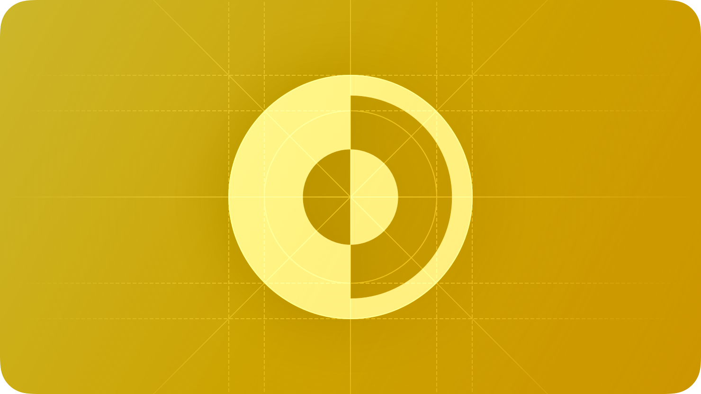

# Dark Mode

<h2>다크 모드는 어두운 색상을 사용해 어두운 환경에 적합한 편안한 시각 환경을 제공하는 시스템 Appearance 설정입니다.</h2>

  

 

iOS, iPadOS, macOS, 그리고 tvOS에서 많은 사람들이 Dark Mode를 기본 인터페이스 스타일로 선택하며, 일반적으로 모든 앱과 게임이 이들의 선호도를 존중하기를 기대합니다. Dark Mode에서는 시스템이 모든 화면, 뷰, 메뉴, 및 컨트롤에 어두운 색상 팔레트를 사용하며, 더 어두운 배경에 대비하여 전경 콘텐츠를 돋보이게 하는 데 높은 대비를 사용할 수도 있습니다.

## Best practices

**별도의 앱 Appearance 설정을 제공하지 마세요.**

앱별 외관 모드 옵션은 사람들이 원하는 외관을 얻기 위해 더 많은 설정을 조정해야 하기 때문에 불편을 초래할 수 있습니다. 더 나쁜 경우에는 시스템 전체 외관 선택에 응답하지 않아 앱이 고장난 것으로 생각할 수도 있습니다.

 

**앱이 두 Appearance 모드에서 모두 잘 보이도록 하세요.**

사람들은 하나의 appearance 모드 또는 다른 모드를 사용할 뿐만 아니라 자동 설정을 선택할 수 있습니다. 이 설정은 앱이 실행 중인 것과 관계없이 조건이 변할 때 라이트 모드와 다크 모드로 전환되어야 합니다.

 

**콘텐츠를 테스트하여 양쪽 외관 모드에서 편안하게 가독성이 유지되도록 확인하십시오.** 

예를 들어, 어두운 모드에서 Increase Contrast 및 Reduce Transparency가 켜져 있는 경우(이 두 가지를 각각 또는 함께), 어두운 배경 위에 어두운 텍스트가 덜 가독성이 있을 수 있는 곳이 있을 수 있습니다. 어두운 모드에서 Increase Contrast를 켜면 어두운 텍스트와 어두운 배경 간의 시각적 대비가 감소할 수 있습니다. 강한 시각을 가진 사람들은 여전히 낮은 대비 텍스트를 읽을 수 있을 수 있지만, 이러한 텍스트는 많은 사람들에게 불가독할 수 있습니다. 자세한 내용은 [Color and effects](https://developer.apple.com/design/human-interface-guidelines/accessibility#Color-and-effects)를 참고하세요.

 

**별도의 경우 다크 모드를 사용하는 것이 좋습니다.** 

몰입형 미디어 재생을 지원하는 앱은 사용자가 미디어에 집중할 수 있도록 영구적으로 다크 모드를 사용하면 좋습니다.

## Dark Mode colors

다크 모드의 컬러 팔레트는 더 어두운 배경색과 더 밝은 전경색을 포함합니다. 보통 라이트 모드에서 반전된 컬러로 구성하지만, 꼭 라이트 모드의 반전 컬러일 필요는 없습니다. 자세한 내용은 [Specifications](https://developer.apple.com/design/human-interface-guidelines/color#Specifications)를 참고하세요.

 

**현재 appearance 모드에 적용되는 컬러를 수용하세요.**
시멘틱 컬러(macOS의 [labelColor](https://developer.apple.com/documentation/appkit/nscolor/1534657-labelcolor) 및 [controlColor](https://developer.apple.com/documentation/appkit/nscolor/1524856-controlcolor) 또는 iOS 및 iPadOS의 [separator](https://developer.apple.com/documentation/appkit/uikit/uicolor/3173139-separator))는 현재 appearance 모드에 따라 자동으로 적용됩니다. 커스텀 컬러가 필요할 때는 Xcode에서 앱 카탈로그에 컬러 세트를 추가하고 적용하세요. appearance 모드에 따라 적용되지 않는 하드 코딩된 컬러나 값은 사용하지 마세요.

 

**모든 appearance 모드에서 충분한 색상 대비를 갖추도록 하세요.**

시스템 컬러를 사용하면 배경 및 전경 콘텐츠 간의 대비 비율을 좋게 만들 수 있습니다. 최소한 컬러 명암비가 4.5:1 보다 낮지 않아야 합니다. 커스텀 배경색과 전경색을 사용하는 경우 더 작은 텍스트에서 7:1 명암비를 갖추어야 합니다. 이러한 비율은 배경에서 전경 콘텐츠가 사용자 눈에 띄도록 보장하며, 콘텐츠가 접근성 지침을 충족하는 데 도움이 됩니다.

 

**흰색 배경의 색을 부드럽게 하세요.**

흰색 배경을 포함하는 콘텐츠 이미지를 표시하는 경우. 다크 모드에서 배경이 빛나지 않도록 이미지를 약간 어둡게 하는 것을 고려하세요.

## Icons and images

시스템은 다크 모드에 자동으로 SF Symbols 및 맞추어

**가능하면 SF Symbols를 사용하세요.**

Symbols는 다이나믹 컬러를 지원하기 때문에 색감이나 선명도를 추가하는 것도 모든 appearance 모드에서 잘 나타납니다. 자세한 내용은 [Color](./color.md)를 참고하세요.

 

**필요한 경우 라이트 및 다크 모드 전용 인터페이스 아이콘을 디자인하세요.**

예를 들어 보름달을 나타내는 아이콘은 밝은 배경과 대비를 이루기 위해 약간 어두운 윤곽선이 필요할 수 있지만, 다크 모드에서 표시될 때는 윤곽선이 필요하지 않습니다. 마찬가지로 물방울을 나타내는 아이콘은 어두운 배경에 대비하기 위해 약간의 윤곽선이 필요할 수 있습니다.

 

**모든 appearance에서 컬러 이미지와 아이콘이 잘 보일 수 있도록 하세요.**

라이트 및 다크 모드에서 모두 잘 보이는 에셋을 사용하세요. 만약 에셋이 한 쪽에서만 잘 보인다면 이를 수정하거나, 별도의 라이트 및 다크 모드 에셋을 만드세요. 에셋 카탈로그를 사용해서 여러 에셋을 싱글 이미지로 결합하세요.

## Text

**라벨에는 시스템에서 제공하는 라벨 컬러를 사용하도록 하세요.**

primary, secondary, tertiary 그리고 quaternary 라벨 컬러는 자동으로 라이트 및 다크 모드에 맞게 조절됩니다.

 

**텍스트 필드 및 텍스트 뷰에는 시스템 뷰를 사용하세요.**

시스템 뷰와 컨트롤을 사용하면 앱의 텍스트가 모든 배경에서 잘 보이고 선명도에 따라 자동으로 조절됩니다. 가능하면 텍스트를 직접 그리는 대신 시스템에서 제공하는 뷰를 사용해서 텍스트를 표시하세요.

## Platform considerations

_tvOS에 대한 추가 고려 사항은 없습니다. 다크 모드는 visionOS 및 watchOS에서 지원하지 않습니다._

### iOS, iPadOS

다크 모드에서 시스템은 두 가지의 배경 컬러를 사용합니다. 이를 base와 elevated라고 하며 하나의 어두운 인터페이스가 다른 인터페이스 계층에 쌓일 때 깊이를 인식하는 것을 향상시키기 위한 것입니다. base 컬러는 어둡게 보이게 하고 elevated 컬러는 밝게 보이도록 해서 깊이감을 조성합니다.

 

**system background color를 선호하세요.**

다크 모드는 다이나믹하므로 인터페이스가 foreground에 있을 때(예: popover 또는 modalsheet) 배경 컬러가 자동으로 base에서 elevated 컬러로 변경됩니다. 시스템은 멀티태스킹 환경에서 앱 간 멀티윈도우에서 컨텍스트에서 윈도우 간 시각적 분리를 제공하기 위해 elevated 컬러를 사용합니다. 커스텀 background color를 사용하면 시스템에서 제공하는 이러한 기능을 사용하기 어려울 수 있습니다.

### macOS

사용자가 일반 설정에서 그라파이트 액센트 컬러를 선택하면 macOS는 윈도우 배경이 현재 데스크탑 이미지에서 컬러를 추출하도록 합니다. 이를 desktop tinting이라고 부르며 윈도우가 주변 콘텐츠와 더 조화롭게 어우러지도록 합니다.

 

**사용자 지정 요소 배경에 약간의 투명도를 포함하도록 하세요.**

투명도를 추가하면 desktop tinting이 활성화될 때 컴포넌트가 윈도우 배경에서 컬러를 추출하므로 시각적인 조화가 이루어집니다. 이 조화를 도모하기 위해서 투명도를 커스텀 컴포넌트에만 추가하고 배경이나 베젤이 보이는 상태에서만 사용하도록 하세요. 또한 컴포넌트가 netural 상태인 경우에만 투명도를 추가하세요. netural 상태란 컬러를 사용하지 않는 상태로 윈도우 배경이 데스크탑에서 다른 위치로 조정되거나 데스크탑 이미지가 변경될 때 컴포넌트의 색상이 변하지 않도록 해야합니다.

## Resources

### Related

- [Color](./foundations/colors.md)

- [Materials](./materials.md)

- [Typography](./typography.md)

### Videos

- [What's New in iOS Design](https://developer.apple.com/videos/play/wwdc2019/808)

- [Implementing Dark Mode on iOS](https://developer.apple.com/videos/play/wwdc2019/214)
