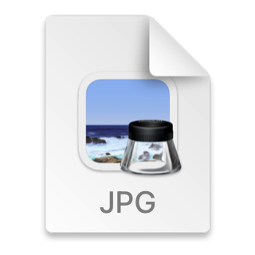
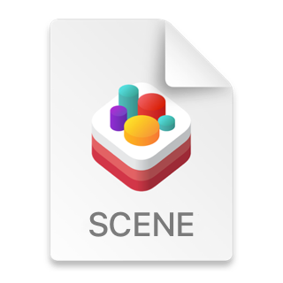

## Icons

<h2>효과적인 아이콘은 사용자가 즉각 인지할 수 있는 단일 콘셉트를 표현하는 그래픽입니다.</h2>

  

앱과 게임은 다양한 아이콘을 사용해서 사용자가 선택할 수 있는 항목이나 동작, 모드를 이해할 수 있도록 도와줍니다. 셰이딩, 텍스처링 및 하이라이팅과 같은 풍부한 시각효과로 개성을 나타낼 수 있는 앱 아이콘과 달리 인터페이스에 사용하는 아이콘은 일반적으로 간소화된 모양과 컬러를 사용해서 의미를 전달합니다.

글리프 또는 템플릿 이미지라고도 하는 인터페이스 아이콘을 디자인하거나 SF Symbol 앱에서 원하는 심볼을 선택해 사용하거나 필요에 맞게 커스텀할 수 있습니다. 인터페이스 아이콘은 모두 검은색과 선명한 컬러를 사용해서 모양을 정의합니다. 시스템은 각 이미지의 겅은색 영역에 다른 컬러를 적용할 수 있습니다. 자세한 내용은 [SF Symbols](https://develoepr.apple.com/design/human-interface-guidelines/sf-symbols)를 참고하세요.

### Best practices

**알아볼 수 있고 매우 단순화된 디자인을 만드세요.**

불필요하게 많은 디테일은 오히려 사용자가 인터페이스 아이콘의 의미를 알 수 없게되어 혼란스럽게 만들 수 있습니다. 대부분의 사용자는 빨리 알아볼 수 있는 단순하고 보편화된 디자인을 기대합니다. 일반적으로 내용과 직접적으로 관련된 친숙한 은유를 시각적으로 활용할 때 잘 표현되었다고 할 수 있습니다.

 

**앱의 모든 인터페이스 아이콘에서 시각적 일관성을 유지하세요.**

커스텀 아이콘만 사용하든지 아니면 커스텀과 시스템에서 제공하는 것을 섞든지, 앱의 모든 인터페이스 아이콘은 일관된 크기, 디테일 수준, 선 두께(또는 무게), 비율을 사용해야 합니다. 아이콘의 시각적인 무게에 따라 다른 아이콘과 시각적으로 일관되도록 보이도록 조절해야 할 수 있습니다.

 

**일반적으로는 인터페이스 아이콘과 인접한 텍스트의 굵기를 맞춥니다.**

아이콘이나 텍스트 중에 어느 하나를 강조하고 싶은게 아니라면 둘 다 동일한 굵기를 사용해서 시각적으로 일관된 모양을 유지하세요.

 

**필요한 경우 커스텀 인터페이스 아이콘에 정렬을 위한 여백을 추가하세요.**

특히 일부 아이콘은 비대칭인 경우 geometry 정렬이 아닌 optical 중앙 정렬을 하는 것이 균형을 유지하는 데 도움이 됩니다. 예를 들어서 아래에 표시된 다운로드 아이콘은 위쪽보다 아래쪽에 시각적인 무게가 쏠려있어 geometry 정렬을 하게 되면 너무 낮아 보일 수 있습니다.

  

이러한 경우에는 아이콘을 optical하게 중앙에 위치할 때까지 약간의 정렬을 해야합니다. 아이콘 주위의 여백으로 조정된 에셋을 만들면 시각적으로 균형을 맞출 수 있습니다.

  

optical 중앙 정렬을 위한 조정은 미세하게 앱의 appearance에 영향을 줄 수 있습니다.

 

**필요한 경우에만 인터페이스 아이콘의 선택된 상태 버전의 아이콘을 제공하세요.**

자동으로 선택 상태를 나타내는 컨트롤과 영역에서 사용되는 아이콘에 대해 선택되거나 선택되지 않은 모습을 제공할 필요는 없습니다. 예를 들어 visionOS 및 iOS의 사이드바, 탭바, macOS의 툴바는 앱의 액센트 색상을 적용하거나 배경을 추가해서 선택된 상태를 표현할 수 있습니다.

iOS 또는 visionOS의 툴바 또는 내비게이션바에서는 선택되거나 선택되지 않은 아이콘을 제공할 수는 있어도 상태에 따라 배경이 변경되는 버튼을 사용하는 것이 일반적입니다.

 

**포괄적인 디자인을 만드세요.**

특정 성별에 대한 불필요한 참조 없이 인간 형상을 묘사하는 것을 선호하고, 여러분의 아이콘이 모두에게 환영 받고 이해하기 쉬운지 확인하세요. 자세한 내용은 [Inclusion](./inclusion.md)을 참고하세요.

 

**의미 전달이 필요한 경우에만 디자인에 텍스트를 포함하세요.**

인터페이스 아이콘에서 텍스트 서식을 나타내는 문자를 사용하는 것이 가장 직접적으로 의미를 전달하는 방법일 수 있습니다. 아이콘에 개별 문자를 표시해야하는 경우, 해당 문자를 지역화하는 것을 잊지 마세요. 텍스트의 한 구절을 나타내야 하는 경우에는 이를 추상적으로 디자인하고, 오른쪽에서 왼쪽으로 사용되는 버전도 포함하세요. 자세한 내용은 [Right to left](./right-to-left.md)를 참고하세요.

 

**커스텀 인터페이스 아이콘을 만든다면 PDF 또는 SVG와 같은 벡터 포맷을 사용하세요.**

시스템은 벡터 기반 인터페이스 아이콘을 자동으로 고해상도 디스플레이에 맞게 조절하기 때문에 고해상도 버전의 아이콘을 따로 제공할 필요가 없습니다. 반면에 PNG는 그림자, 질감, 하이라이트 등의 효과를 포함하는 앱 아이콘 및 다른 이미지에 사용되는 포맷이지만 확대나 축소를 지원하지 않으므로 PNG 기반의 인터페이스 아이콘에 대해서는 여러 버전을 제공해야 합니다. 또는 커스텀 SF Symbol을 만들고 해당 심볼의 하이라이트가 인접한 텍스트와 일치하도록 크기를 지정할 수도 있습니다. 자세한 내용은 [SF Symbols](./sf-symbols.md)를 참고하세요.

**커스텀 인터페이스 아이콘에 대한 대체 텍스트 라벨을 제공하세요.**

대체 텍스트 라벨 또는 손쉬운 사용 설명은 화면에 표시되는 건 아니지만 VoiceOver를 통해 화면에 무엇이 있는지를 음성으로 설명하여 시각 장애가 있는 사람들의 화면 이동을 도와줍니다. 자세한 내용은 [Content descriptions](./accessibility.md/#content-descriptions)를 참고하세요.

**Apple 하드웨어 제품을 복제해서 사용하지 마세요.**

Apple 하드웨어 디자인은 자주 변경되기 때문에 인터페이스 아이콘이나 다른 콘텐츠가 오래되어 보이게 할 여지가 있습니다. Apple 하드웨어를 표시해야 하는 경우 [Apple Design Resources](https://developer.apple.com/design/resources/)나 다양한 Apple 제품을 나타내는 SF Symbols에서 제공되는 이미지만 사용하세요.

## Platform considerations

_iOS, iPadOS, tvOS, visionOS, watchOS에 대한 추가적인 고려사항은 없습니다._

### macOS

### Document icons

여러분이 제작한 macOS 앱이 사용자 정의 문서 포맷을 사용한다면, 해당 유형을 나타내는 문서 아이콘을 생성할 수 있습니다. 문서 아이콘은 우측 상단 모서리가 접힌 종이처럼 보입니다. 이 독특한 모습은 아이콘 크기가 작을 때에도 문서를 다른 앱이나 콘텐츠와 구별하는 데 도움이 됩니다.

지원하는 파일 유형에 대한 문서 아이콘을 제공하지 않으면 macOS는 캔버스에 앱 아이콘과 파일의 확장자를 합성하여 아이콘을 자동으로 생성합니다. 예를 들어, Preview는 JPG 파일을 나타내기 위해 시스템에서 생성한 문서 아이콘을 사용합니다.

  

경우에 따라 앱이 처리하는 파일 유형의 범위를 나타내기 위해 문서 아이콘 세트를 만드는 것이 좋을 수 있습니다. 예를 들어, Xcode는 프로젝트, AR 객체 및 Swift 코드 파일을 구분하는 데 도움이 되도록 사용자 정의 문서 아이콘을 사용합니다.

사용자 정의 문서 아이콘을 만들려면 배경, 중앙 이미지, 텍스트의 어떤 조합이든 제공할 수 있습니다. macOS 11부터 시스템은 필요한 대로 이러한 요소를 계층화해서 마스킹하고, 기본 아이콘에 합성합니다.

Apple Design Resources에서는 문서 아이콘의 사용자 정의 배경 채우기와 중앙 이미지를 만들기 위해 사용할 수 있는 템플릿을 제공합니다. 이 템플릿을 사용하는 동안 아래 가이드라인을 따르세요.

 

**문서 유형을 명확히 전달하는 간단한 이미지로 디자인하세요.**

배경 채우기, 중앙 이미지를 둘 다 사용하더라도 복잡하지 않은 형태와 명확한 색상을 선호하세요. 문서 아이콘은 16x16 px 크기까지 작게 표시될 수 있으므로 모든 크기에서 인식이 가능한 디자인으로 만들어야 합니다.

 

**배경 채우기에 대한 단일하고 표현력 있는 이미지를 디자인하는 것은 문서 유형을 이해하고 인식하는 데 좋은 방법일 수 있습니다.**

예를 들어서 Xcode와 TextEdit은 중앙 이미지를 포함하지 않는 풍부한 배경 이미지를 사용합니다.

 

**작은 크기의 문서 아이콘에서도 복잡해 보이지 않도록 하세요.**

큰 크기의 문서 아이콘에서의 디테일이 작은 크기의 문서 아이콘에서 흐릿하게 보일 수 있고, 눈에 띄지 않을 수 있습니다. 예를 들어 사용자 정의 하트 문서 아이콘의 그리드를 중간 크기에서도 명확하게 유지하기 위해 더 적은 선을 사용하고 두껍게 해야할 수 있습니다. 16x16 px 크기의 문서 아이콘에서는 하트의 윤곽선을 완전히 제거해야 할 수 있습니다.

 

**문서 아이콘의 배경 채우기의 오른쪽 상단에 중요한 콘텐츠를 배치하지 마세요.**

시스템은 이미지를 문서 아이콘 모양에 맞게 자동으로 마스크하고 채우기 위해 하얀색으로 접힌 모서리를 적용합니다. 아래 나열된 크기로 배경 이미지 세트를 만드세요.

- 512x512 px 1@x, 1024x1024 px 2@x
- 256x256 px 1@x, 512x512 px 2@x
- 128x128 px 1@x, 256x256 px 2@x
- 32x32 px 1@x, 64x64 px 2@x
- 16x16 px 1@x, 32x32 px 2@x

 

**앱과의 연관성을 전달할 수 있는 객체가 있다면 해당 객체를 중앙 이미지로 만들어 보세요.**

크기에 관계없이 명확하게 알아볼 수 있는 간단한 이미지를 디자인하세요. 중앙 이미지의 크기는 문서 아이콘 크기의 절반으로 표시합니다.

- 256x256 px 1@x, 512x512 px 2@x
- 128x128 px 1@x, 256x256 px 2@x
- 32x32 px 1@x, 64x64 px 2@x
- 16x16 px 1@x, 32x32 px 2@x

 

**이미지 캔버스 크기의 약 10%를 차지하는 여백을 두고 이미지를 유지하세요.**

이미지의 일부는 optical 중앙 정렬을 위해 이 여백을 벗어날 수 있지만 이미지가 캔버스의 약 80%를 차지할 때 가장 잘 보입니다. 예를 들어 256x256 px 캔버스의 중앙 이미지는 205x205 px 크기의 영역에 들어갈 것입니다.

  

**사용자가 문서 유형을 이해하는 데 도움이 되는 경우 간단한 용어를 지정하세요.**

기본적으로 시스템은 문서의 확장자를 문서 아이콘의 하단 가장자리에 표시하지만, 확장자가 익숙하지 않은 경우 더 설명적인 용어를 제공할 수 있습니다.
예를 들어 SceneKit의 scene 파일의 경우, 확장자가 ".scn"이지만 문서 아이콘에는 "SCENE"이라는 용어가 표시됩니다.

  

## Resources

### Related

[App icons](./app-icons.md)

[SF Symbols](./sf-symbols.md)

### Videos

[Designing Glyphs](https://developer.apple.com/videos/play/wwdc2017/823)
