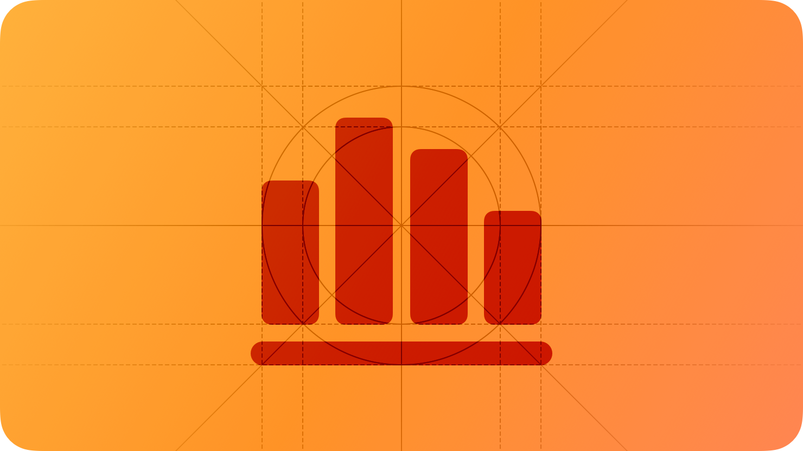

# Charting Data

<h2>데이터를 차트로 표시하면 정보를 명확하게 전달할 수 있습니다.</h2>

  

 

차트는 사용자가 많은 텍스트를 읽고 이해할 필요 없이 복잡한 정보를 전달할 수 있는 효율적인 방법입니다.
차트의 그래픽 특성은 데이터를 시각적으로 표현하므로 사용자 경험을 개선할 수 있는 기회를 제공합니다. 차트를 만드는 데 사용하는 구성 요소에 대한 자세한 내용은 [Charts](./charts.md)를 참고하세요.

단순한 그래픽부터 복잡한 데이터 시각화까지 다양한 종류의 차트를 사용해 정보를 제공할 수 있습니다. 따라서 사용자를 다양한 관점에서 데이터를 탐색하도록 유도할 수 있습니다. 간단한 차트든 복잡한 차트든 다음과 같이 중요한 데이터 기반의 작업을 수행할 수 있습니다.

- 과거 또는 예측한 값을 기반으로 하는 추세 분석
- 시간의 흐름에 따라 변화하는 프로세스, 시스템 또는 현재 상태의 시각화
- 여러 카테고리의 데이터를 비교해서 서로 다른 항목 또는 다른 시간대의 동일한 항목 평가

모든 데이터를 차트에 표시할 필요는 없습니다. 단순히 사용자에게 데이터를 제공하고 분석하는 것은 필요가 없는 경우 스크롤 또는 검색, 정렬이 가능한 목록이나 테이블을 사용하는 것이 좋습니다.

## Best practices

**데이터 그룹에 대한 중요한 정보를 강조하려는 경우 차트를 사용해보세요.**

차트는 시각적으로 눈에 잘 띄기 때문에 사용자가 이목을 집중시킬 수 있습니다. 따라서 사용자가 관심 있는 데이터에서 무엇을 얻을 수 있는지 명확한 정보를 전달해야 합니다.

 

**되도록 차트를 심플하게 유지하고 사용자가 추가적인 정보를 원할 때 설정이 가능하도록 하세요.**

너무 많은 데이터를 차트에 담아내려고 하지 마세요. 데이터가 너무 많이 시각화되면 사용자가 데이터를 이해하고 사용하는 것이 어려워질 수 있습니다. 제공할 데이터가 많다면 사용자가 점진적으로 원하는 데이터를 찾아볼 수 있도록 하는 것이 좋습니다. 예를 들어 사용자가 자신의 관심사에 맞게 다양한 세부 정보 설정 또는 하위 그룹을 선택할 수 있도록 하는 것입니다.

 

**앱의 모든 차트에 손쉬운 사용을 적용하세요.**

차트는 데이터의 그래픽 시각적 설명을 통해 이해할 수 있습니다. 설명 외에도 값이나 구성 요소를 설명하는 손쉬운 사용 레이블처럼 더 많은 사용자가 차트와 상호 작용할 수 있는 손쉬운 사용 기능을 제공하는 것은 중요합니다. 자세한 내용은 [Enhancing the accessibility of a chart](./charts.md/#enhancing-the-accessibility-of-a-chart)를 참고하세요.

## Designing effective charts

**일반적인 차트 유형을 사용하는 것이 좋습니다.**

막대 그래프, 꺾은선형 그래프처럼 일반적으로 사용하는 차트는 사용자에게 익숙한 경향이 있으므로 쉽게 이해할 수 있습니다. 자세한 내용은 [Charts](./charts.md)를 참고하세요.

 

**새로운 방식으로 데이터를 표시하는 차트를 만들어야 하는 경우 해석하는 방법도 사용자에게 알리세요.**

예를 들어 Watch가 iPhone과 페어링되면 활동 앱은 활동 링을 개별적으로 애니메이션화해서 보여주고 각 링의 움직임, 운동 및 일어서기 기능이 어떻게 매핑되는지 보여줍니다.

 

**여러 관점에서 데이터를 검사하고 좋은 차트를 만들기 위해 표시할 수 있는 세부 정보를 찾으세요.**

예를 들어 합계나 평균처럼 사용자가 관심을 가질 만한 데이터를 결정하는 것입니다. 다른 관점으로는 사용자가 유용한 하위 그룹을 탐색하면 특정 값을 보여주는 것입니다.

 

**차트에 설명 텍스트를 추가해서 이해를 돕도록 하세요.**

설명이 포함된 텍스트, 제목, 부제목, 주석은 차트에서 가장 중요한 정보를 강조하는 데 도움이 되는 요소입니다.
또, 차트의 헤드라인 또는 요약 정보를 전달하는 역할을 하는 간단한 텍스트를 표시하면 사용자가 필수 정보를 한 눈에 파악할 수 있습니다. 예를 들어 날씨 앱은 다음 24시간 동안의 시간 별 예보 정보 위에 "다음 시간에 비가 올 확률"과 같은 당장 필요한 정보를 요약하는 텍스트를 표시합니다. 물론 이러한 텍스트는 차트의 접근성을 높이는데 도움은 되지만, 그렇다고 손쉬운 사용 레이블을 대신하는 것은 아닙니다.

 

**차트의 크기를 주제 및 세부 내용, 기능에 맞춥니다.**

일반적으로 차트는 포함해야하는 정보를 한 눈에 보기 쉽게 표시할 수 있을 만큼 충분히 커야 합니다. 예를 들어 사용자가 차트의 세부 정보와 설명을 쉽게 읽을 수 있도록 제공하려면 차트의 공간을 충분하게 제공하세요. 작은 차트는 큰 차트의 미리 보기 버전으로 사용하는 것이 좋습니다.

**여러 차트가 다른 용도로 사용하는 경우가 아니라면 일관성을 유지하는 것이 좋습니다.**

여러 차트가 비슷한 용도로 사용되는 경우 각 차트에 대해 다른 유형이나 스타일을 사용해서 관련이 없는 차트인 것처럼 보여주는 것은 좋지 않습니다. 일관된 스타일을 사용하면 사용자가 한 차트에 대해 이해한 내용을 통해 다른 차트를 쉽게 이해할 수 있기 때문입니다. 만약 차트 간 차이점을 강조해야 하는 경우 다른 유형이나 스타일을 사용하면 됩니다.

 

**동일한 데이터를 사용하는 여러 차트는 연계성을 유지하세요.**

동일한 데이터를 사용하는 여러 개의 차트를 사용한다면 하나의 차트 유형과 색상, 주석, 레이아웃을 사용해 데이터셋이 연계된다는 것을 사용자에게 알리는 것이 좋습니다. 예를 들어 건강 앱은 각각 특정 스타일을 사용해서 걸음 수 또는 심박수와 같은 영역을 나타내는 작은 차트가 표시됩니다. 그렇지만 사용자가 모든 데이터를 표시하려는 경우에는 동일한 스타일, 색상, 레이아웃을 사용합니다.

## Platform considerations

_iOS, iPadOS, macOS, tvOS, watchOS, visionOS에 대한 추가 고려사항은 없습니다._

## Resources

### Related

- [Charts](./charts.md)

### Developer documentation

- [Swift Charts](https://developer.apple.com/documentation/Charts)

### Videos

- [Design app experiences with charts](https://developer.apple.com/videos/play/wwdc2022/110342)
- [Design an effective chart](https://developer.apple.com/videos/play/wwdc2022/110340)
- [Hello Swift Charts](https://developer.apple.com/videos/play/wwdc2022/10136)
