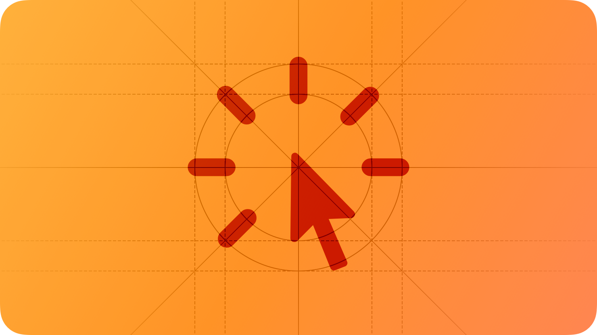

# Feedback

<h2>피드백은 사용자가 무슨 일이 일어나고 있고, 다음에 할 수 있는 일을 발견하고, 작업 수행의 결과를 이해하고, 실수를 피하는 데 도움이 됩니다.</h2>

  

 

사용자가 앱이나 게임을 상호 작용할 때 명확하고 일관된 피드백을 제공하면 직관적으로 느껴지고 더 깊이 있는 탐색을 유도할 수 있습니다. 피드백은 다음과 같은 여러 가지 사항을 전달할 수 있습니다.

- 현재 상태
- 부정적인 결과를 초래할 수 있는 행동에 대한 경고
- 실수나 문제가 있는 상황을 수정할 수 있는 기회

가장 효과적인 피드백은 정보의 중요성과 전달 방법을 일치시키는 것입니다. 예를 들어 사용자가 필요할 때 볼 수 있도록 상태 정보를 수동적으로 표시하는 것이 좋습니다. 반대로 데이터 손실 가능성에 대한 경고는 사용자가 문제를 피할 수 있도록해야 합니다.

## Best practices

**모든 피드백에 접근할 수 있도록 확인하세요.**

여러 방법으로 피드백을 제공하면 더 많은 사용자에게 도달하고 자신에게 적합한 방식으로 피드백을 받을 수 있는 기회를 제공합니다. 예를 들어 색상, 텍스트, 사운드 및 햅틱을 사용하여 피드백을 제공하면 사람들은 기기를 무음으로 설정하든, 화면에서 시선을 돌리든, VoiceOver를 사용하든 무엇이든 관계없이 피드백을 받을 수 있습니다. 자세한 내용은 [Playing haptics](./playing-haptics.md)를 참고하세요.

 

**상태에 대한 피드백은 인터페이스에 통합하는 것이 좋습니다.**

상태 피드백이 설명하는 항목 근처에서 상태 피드백을 사용할 수 있으면 사람들은 조치를 취하거나 현재 컨텍스트를 벗어나지 않고도 중요한 정보를 얻을 수 있습니다. 예를 들어, iOS 및 iPadOS의 Mail은 가장 최근 업데이트를 설명하고 메일상자 화면의 도구 막대에 읽지 않은 메시지 수를 표시하여 정보를 눈에 거슬리지 않게 하지만 사람들이 관심이 있을 때 쉽게 확인할 수 있도록 합니다.

 

**Alert을 사용하여 중요하고 이상적인 정보를 전달하세요.**

기본적으로 alert은 현재 컨텍스트를 방해하는 성격을 가지고 있으므로 정보의 중요성 수준과 맞추어야 합니다. alert을 너무 자주 사용하거나 중요하지 않은 정보를 전달하는 경우 alert의 효과를 잃을 수 있습니다. 자세한 내용은 [Alerts](https://developer.apple.com/design/human-interface-guidelines/alerts)를 참고하세요.

 

**예기치 않고 되돌릴 수 없는 데이터 손실을 유발할 수 있는 작업을 시작할 때 사용자에게 경고합니다.**

반대로, 데이터 손실이 작업의 예상 결과인 경우 사용자에게 alert을 보내지 마세요. 예를 들어, Finder는 파일을 삭제하는 것이 예상된 결과이기 때문에 파일을 버릴 때마다 사용자에게 alert을 보내지 않습니다.

 

**적절한 경우 중요한 작업이나 작업이 완료되었는지 확인합니다.**

예를 들어, 사용자는 Apple Pay 결제가 성공했음을 확인할 수 있는 피드백을 받길 원합니다. 이러한 종류의 확인은 충분히 중요한 활동에 대한 것으로 보존하는게 좋습니다. 사용자는 일반적으로 동작이나 특정 작업이 성공할 것으로 기대하기 때문에 실패할 때에도 알아야 합니다.

 

**명령을 수행할 수 없는 사용자에게 표시하고 그 이유를 이해하도록 도와주세요.**

예를 들어 사용자가 목적지를 지정하지 않고 경로를 요청하면 Maps는 경로를 제공할 수 없다고 알려줍니다.

## Platform considerations

_iOS, iPadOS, macOS, tvOS, or visionOS에 대한 추가 고려사항은 없습니다._

### watchOS

**watchOS 앱에 확정적이지 않은 Progress indicator를 표시하지 마세요.**

애니메이션이 적용된 Indicator는 사용자가 화면을 계속 주시하고 있어야 한다고 생각하게 만들 수 있으며, 이는 좋은 사용자 경험이 아닙니다. 더 나은 경험을 제공하려면 프로세스가 완료되면 알림을 받게 될 것이라고 사용자에게 전달하세요.

## Resources

### Related

- [Playing audio](./playing-audio.md)
- [Playing haptics](./playing-haptics.md)
- [Motion](../foundations/motion.md)

### Developer documentation

- [Animation and haptics](https://developer.apple.com/documentation/uikit/animation_and_haptics)

### Videos

- [Designing Fluid Interfaces](https://developer.apple.com/videos/play/wwdc2018/803)
- [Essential Design Principles](https://developer.apple.com/videos/play/wwdc2017/802)
