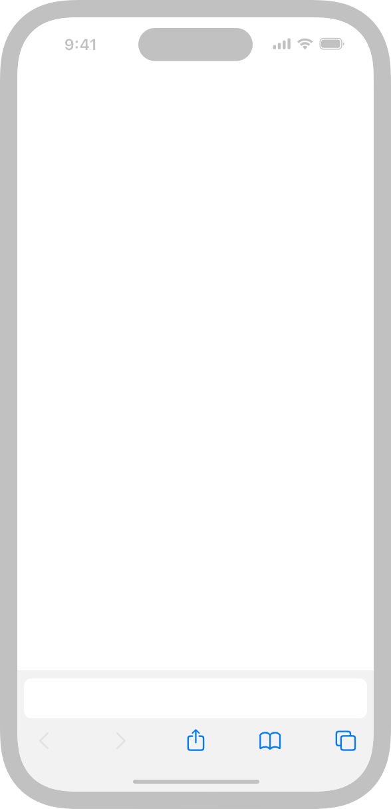
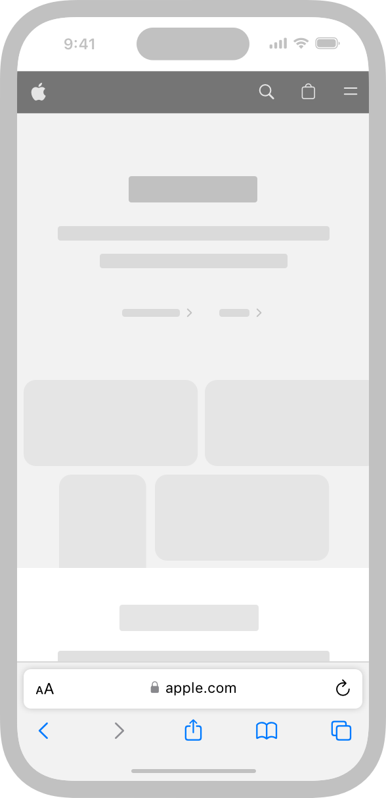

# Launching

<h2>사용자는 앱이나 게임을 즉시 사용할 수 있도록 도와주는 간결한 실행 경험을 높게 평가합니다.</h2>

  

## Best practices

**플랫폼에 필요한 경우에만 런치 스크린을 제공하세요.**

iOS, iPadOS 및 tvOS에서는 시스템이 앱이나 게임이 시작되자 마자 런치 스크린을 표시하고 빠르게 첫 화면으로 교체하여 사용자에게 경험이 빠르고 응답성 있는 것처럼 느끼게 합니다. 이상적인 런치 스크린은 사용자의 눈에 띄지 않게 하는 것입니다. 자세한 내용은 [Launch Screen](https://developer.apple.com/design/human-interface-guidelines/launching#Launch-screens)을 참고하세요. 추가적으로 macOS, visionOS 및 watchOS 앱은 런치 스크린이 필요하지 않습니다.

 

**필요한 경우에만 초기 설정 데이터를 요청하세요.**

사용자가 앱이나 게임을 시작하자마자 뭔가를 성취하도록 도우세요. 가능하면 기존 기기 설정 및 기본 값에서 데이터를 가져오세요. 사용자가 유용한 작업을 하기 전에 로그인해야 하는 경우라면 [Sign in with Apple](https://developer.apple.com/design/human-interface-guidelines/sign-in-with-apple)을 제공하거나 iCloud와 같은 동기화 서비스를 사용하는 것을 권장합니다.

 

**적절한 시점에 개인 데이터에 접근할 권한을 요청하세요.**

가급적 앱이 시작될 때 개인 데이터 접근 권한을 요청하는 것은 피하고, 대신에 사용자가 개인 데이터를 필요로 하는 기능을 원하는 경우 권한을 요청하세요. 예를 들어 네비게이션 앱은 시작할 때 곧바로 사용자 위치 정보에 접근해야 할 것 같지만, 네비게이션 관련 기능을 사용하려는 경우가 아니라면 위치 정보가 필요 없습니다. visionOS에서는 앱이 정보에 액세스하려면 [Full Space](https://developer.apple.com/design/human-interface-guidelines/immersive-experiences)에서 실행 중이어야 합니다. 자세한 내용은 [Privacy](https://developer.apple.com/design/human-interface-guidelines/privacy)를 참고하세요.

 

**사용자들이 리뷰를 보거나 리뷰를 작성하기 전에 앱을 즐길 시간을 제공하세요.**

사용자는 앱을 실행하면 바로 사용하고 싶어합니다. 앱의 경험을 충분히 쌓은 후에야 이를 평가하고 잠재적인 사용자가 유용하게 여길 수 있는 구체적인 리뷰를 작성하기 원합니다. 첫 실행을 간결하게 하려면 다음을 고려해보세요:

- App Store에 약관 및 면책 조항을 표시해서 앱을 다운로드 하기 전에 사용자가 읽을 수 있도록 하세요.
- 사용자가 앱을 충분히 체험한 후에 평가하고 구체적인 리뷰를 제공할 수 있도록 평가 및 리뷰를 요청합니다.

앱이 재시작될 때 이전 상태를 복원하여 사용자가 이전 위치에서 계속할 수 있도록 합니다. 사용자에게 이전 위치로 돌아가려면 이전 단계를 반복하도록 하는 것은 피하십시오. 가능한 경우 이전 상태의 세부 정보를 최대한 복원하세요. 예를 들어 뷰를 가장 최근 위치로 스크롤하고 창을 사용자가 나갈 때와 동일한 상태 및 위치로 표시하세요.

## Launch screens

모든 플랫폼이 런치 스크린을 필요로 하는 것은 아닙니다.

- iOS, iPadOS 및 tvOS 앱은 런치 스크린을 제공해야 합니다.
- macOS, visionOS 및 watchOS 앱은 런치 스크린이 필요하지 않습니다.

런치 스크린은 온보딩이나 스플래시 화면도 아니고 예술적인 표현을 위한 것도 아닙니다. 런치 스크린의 유일한 기능은 앱이 빠르게 시작되고 바로 사용이 가능하다는 인식을 향상시키는 것입니다.

**앱의 첫 번째 뷰와 거의 동일한 런치 스크린을 디자인하세요.**

런치 스크린에 다른 요소를 포함하면 안 됩니다. 사용자가 첫 번째 뷰 간에 이질감을 느낄 수 있기 때문입니다. 또, 런치 스크린이 [Dark Mode](../founadtions/dark-mode.md)와 같이 현재 앱의 appearance와 일치하는지 확인하세요.

  
  

 

**런치 스크린에 텍스트를 포함하지 마세요.**

런치 스크린에 표시되는 텍스트는 지역화를 할 수 없습니다.

 

**런치 스크린 경험을 중요하게 생각하지 마세요.**

첫 번째 뷰로의 전환을 부드럽게 하는 디자인하고, 사용자가 바로 앱을 사용하지 못하게 하는 런치 스크린은 사용하지 마세요.

 

**광고는 하지 마세요.**

런치 스크린은 브랜드를 홍보하는 용도가 아닙니다. 스플래시 화면이나 "About"처럼 보이는 화면을 만들지 마세요. 로고나 다른 브랜딩 요소를 포함하고 싶다면 앱의 첫 번째 뷰를 사용하세요. 만약에 앱이나 게임이 첫 첫 번째 뷰로 전환되기 전에 단색으로 표시하는 경우 동일한 단색만 표시하는 런치 스크린을 만드세요.

 

## Platform considerations

_macOS, watchOS에 대한 추가 사항은 없습니다._

## iOS, iPadOS

**적절한 방향으로 실행하세요.**

앱이 세로 모드와 가로 모드를 모두 지원하는 경우 기기의 현재 방향을 사용해서 실행하세요. 앱이 만약 한 가지 방향만 지원하는 경우 해당 방향으로 실행하고 필요에 따라 사용자가 기기를 회전할 수 있도록 하세요. 가로 모드 전용 앱은 기기를 왼쪽이나 오른쪽으로 회전시켜도 올바르게 작동해야 합니다. 자세한 내용은 [Layout](foundations/layout.md)을 참고하세요.

## tvOS

tvOS 앱에서 자주 사용되는 [layered images](foundations/images.md/#Layered-images)와는 달리, 런치 스크린은 정적입니다.

**라이브 앱의 경우 사용자가 앱을 시작한 후 곧바로 자동 재생을 시작하는 것이 좋습니다.**

사용자는 TV 시청하기 위해 앱을 사용하므로, 일정 시간 동안 활동이 없을 경우 최근에 시청한 라이브 콘텐츠나 새로운 콘텐츠를 재생하는 것이 좋을 수 있습니다. 자세한 내용은 [Live-viewing apps](./live-viewing-apps.md)를 참고하세요.

## visionOS

**가능하면 빨리 실행하세요.**

만약 앱이 빠르게 콘텐츠를 로드하지 않은 경우라면 시스템은 앱 아이콘을 포함한 윈도우를 표시합니다. 이러한 윈도우는 Shared Space에서 실행될 때 나타나는 첫 윈도우와 동일한 배경과 크기를 사용합니다. 앱이 Full Space에서 실행 중인 경우 윈도우는 시스템에서 정의한 크기를 사용합니다.

**앱이 완전히 몰입할 수 있는 경우에도 Shared Space에서 실행하는 것을 고려하세요.**

Shared Space에서 윈도우를 열면 로드 시간을 확보하면서 앱에 대한 더 많은 컨텍스트를 제공할 수 있으며 완전 몰입형 경험을 제공할 수 있습니다. 자세한 내용은 [Immersive experiences](foundations/immersive-experiences.md)를 참고하세요.

## Resources

### Related

- [Onboarding](./onboarding.md)
- [Loading](./loading.md)

### Developer documentation

- [Specifying your app's launch screen](https://developer.apple.com/documentation/uikit/app_and_environment/specifying-your-app-s-launch-screen)
- [Responding to the launch of your app](https://developer.apple.com/documentation/uikit/app_and_environment/responding_to_the_launch_of_your_app)

### Videos

- [Optimizing App Launch](https://developer.apple.com/videos/play/wwdc2019/423/)
- [Love at First Launch](https://developer.apple.com/videos/play/wwdc2017/816/)
