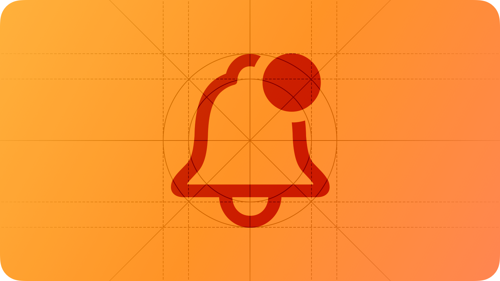

# Managing notifications

<h2>알림은 기기가 잠겨 있거나 사용 중이거나 상관없이 사용자에게 중요한 정보를 제공할 수 있습니다.</h2>

  

 

알림을 보내기 전에는 사용자에게 권한을 요청해야 합니다. 사용자는 시스템 설정에서 이를 변경하거나 알림 자체를 무음으로 할 수도 있습니다. (일부 지역의 경우 긴급재난문자 알림은 제외)

## Intergrating with Focus

사용자는 관심 있는 것에 대한 알림을 받을 수 있지만 떄로는 방해가 될 수 있습니다. 따라서 이를 해결하기 위해 시스템 설정에서 알림 시간이나 집중 모드를 설정할 수 있습니다.

- 집중 모드는 사용자가 수면, 업무, 독서 또는 운전과 같은 활동 중에 알림을 필터링하는 데 도움이 됩니다.

- 알림 예약을 통해 사용자는 알림 알림을 즉시 받을지 아니면 선택한 시간에 전달되는 요약으로 받을지 선택할 수 있습니다.

사람들은 알림 경고를 전달하기 위해 포커스를 뚫을 수 있는 연락처와 앱을 식별한다. 예를 들어, Work Focus에서 사람들은 알림이 도착하자마자 직장 동료, 가족 구성원 및 업무 관련 앱으로부터 알림을 받기를 원할 수 있다. 사람들은 또한 포커스 동안 모든 Time Sensitive 알림 경고를 받기를 원할 수 있다. Time Sensitive 알림은 사람들이 즉시 얻는 것에 감사하는 필수 정보를 포함한다.

> **Important**
>
> 집중 모드가 사용자에게 알림을 보내는 것을 늦출 수 있지만 알림 자체는 보내지는대로 바로 볼 수 있습니다.

이러한 사용자 동작을 지원하려면 먼저 앱이나 게임에서 보낼 수 있는 알림 유형을 식별해야 합니다. 전화, 메시지와 같은 직접 통신을 지원하는 경우 communication 알림을 사용합니다. 다른 유형의 알림은 noncommunication 알림을 사용하세요. 통신 알림을 지원하려면 SiriKit을 채택하면 사용자가 Siri를 사용해서 알림을 사용자 지정할 수 있습니다. 개발자 가이드라인은 [INSendMessageIntent](https://developer.apple.com/documentation/sirikit/insendmessageintent) 및 [UNNotificationContentProviding](https://developer.apple.com/documentation/usernotifications/unnotificationcontentproviding)를 참고하세요.

noncommunication 알림은 시스템 상 방해 레벨(Interruption level)을 지정해야 합니다. 시스템은 지정된 방해 레벨(Interruption level)을 통해 수신자에게 알림을 전달합니다. communication 알림이 도착하면 시스템은 송신자를 통해 알림을 전달할지 결정합니다.

시스템은 noncommunication 알림에 대해서 4가지의 방해 레벨(Interruption level)을 지원합니다.

- Passive: 사용자가 자신의 편의에 맞게 볼 수 있는 정보(예: 레스토랑 추천)
- Active(기본): 사용자가 알고 싶어할 수 있는 정보(예: 좋아하는 스포츠 팀의 점수)
- Time Sensitive: 개인에게 직접적으로 영향을 줄 수 있는 즉각적인 주의를 요하는 정보(예: 배송, 보안)
- Critical: 건강 및 안전에 관한 긴급 정보(예: 긴급재난문자)

|방해 레벨|수신 예약 오버라이딩|집중 모드 무시|iPhone 및 iPad에서 무음 스위치 오버라이딩|
|:---|:---|:---|:---|
|Passive|아니요|아니요|아니요|
|Active|아니요|아니요|아니요|
|Time Sensitive|네|네|아니요|
|Critical|네|네|네|

> **Important**
> 
> Critical 알림은 무음 스위치를 무시하고 예약된 수신자 재정의를 허용합니다.

## Best practices

**각 알림의 긴급성을 정확하게 표현해서 신뢰를 구축하세요.**

모든 알림을 끄는 것을 포함하여 알림을 받는 방법을 조정할 수 있는 여러 가지 방법이 있으므로 방해 레벨을 지정할 때 가능한 한 현실적이어야 합니다. 높은 수준의 긴급성을 사용해서 우선 순위가 낮은 알림을 방해한다고 느끼지 않도록 해야 합니다.

 

**Time Sensitive 레벨은 해당 순간에 관련된 알림에만 사용하세요.**

긴급한 알림이 집중 모드 또는 예약된 전송을 통해 Time Sensitive 유형의 알림이 표시되는 이유를 설명하기 위해, 현 시점 또는 1시간 이내에 발생할 이벤트에 관한 것이어야 합니다. 사용자가 앱에서 처음으로 Time Sensitive 알림을 받으면 시스템은 해당 알림이 어떻게 도착했는지 설명하고, 사용자가 해당 정보를 동의하지 않는 경우 해당 알림을 비활성화할 수 있도록 해야 합니다. 그 이후로는 주기적으로 사용자에게 추가적인 기회를 제공하세요. 개발자 가이드라인은 [UNNotificationInterruptionLevel](https://developer.apple.com/documentation/usernotifications/unnotificationinterruptionlevel)을 참고하세요.

## Sending marketing notifications

사용자가 마케팅 또는 홍보 콘텐츠 알림을 수신하는 데 명시적으로 동의하지 않는 한 알림을 사용하여 마케팅이나 홍보 콘텐츠를 보내지 마세요. 사용자가 앱이나 게임과 관련된 새로운 기능, 콘텐츠, 이벤트를 알고 싶을 때 마케팅 알림을 받을 수 있는 권한을 부여하세요.

**마케팅 알림을 보내기 위해 Time Sensitive 인터럽션 레벨을 사용하지 마세요.**

사람들은 앱에서 마케팅 알림을 수신하는 데 동의했을 수 있지만, 집중 모드나 예약 설정을 위반해서는 안됩니다.

 

**홍보나 마케팅 알림을 보내려면 사용자 권한을 얻으세요.**

사용자에게 마케팅 알림을 보내기 전에 권한을 얻어야 합니다. 알림, 모달 뷰 또는 보내려는 유형을 설명하고 사용자에게 동의 또는 거부할 수 있는 명확한 방법을 제시하는 인터페이스를 만드세요.

 

**앱 내에서 알림 설정을 관리할 수 있도록 하세요.**

정보 또는 마케팅 알림을 보내기 위한 권한을 요청하는 것 외에도, 자신의 선택을 변경할 수 있는 앱 내 설정 화면도 제공해야 합니다. 자세한 내용은 [Settings](settings.md)를 참고하세요.

## Platfrom considerations

_iOS, iPadOS, macOS, tvOS, visionOS에 대한 추가 고려사항은 없습니다._

### watchOS

기본적으로 iPhone의 앱에 사용하는 알림 설정은 Watch의 동일한 앱에도 적용됩니다. 사용자는 iPhone의 Apple Watch 앱에서 이러한 설정을 관리하거나, Watch에 알림이 도착할 때 왼쪽으로 쓸어넘겨 1시간 음소거 또는 Time Sensitive 끄기와 같은 옵션에 접근할 수 있습니다.

## Resources

### Related

- [Privacy](../foundations/privacy.md)

### Developer documentation

- [User Notifications](https://developer.apple.com/documentation/usernotifications)

### Videos

- [Send communication and Time Sensitive notifications](https://developer.apple.com/videos/play/wwdc2021/10091)
- [The Push Notifications primer](https://developer.apple.com/videos/play/wwdc2020/10095)
